# Random Map Gallery

A brief tour of some of the map generator's capabilities.

Click on a map to open it up in the map generator. From there, you can tweak the settings or save the map's files.

## Symmetry

### Rotational symmetry

A classic and visually pleasing map format.

[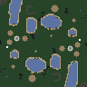](https://ashleynewson.github.io/openra-map-generator/version-20240603/?settings=eyJzZWVkIjo4MjQyNDc1NDEsInNpemUiOjk2LCJyb3RhdGlvbnMiOjIsIm1pcnJvciI6MCwicGxheWVycyI6MSwiY3VzdG9tTmFtZSI6IiIsIndhdmVsZW5ndGhTY2FsZSI6MC4yLCJ3YXRlciI6MC4yLCJtb3VudGFpbnMiOjAuMSwiZm9yZXN0cyI6MC4wMjUsImV4dGVybmFsQ2lyY3VsYXJCaWFzIjowLCJ0ZXJyYWluU21vb3RoaW5nIjo0LCJzbW9vdGhpbmdUaHJlc2hvbGQiOjAuMzMsIm1pbmltdW1MYW5kU2VhVGhpY2tuZXNzIjo1LCJtaW5pbXVtTW91bnRhaW5UaGlja25lc3MiOjUsIm1heGltdW1BbHRpdHVkZSI6OCwicm91Z2huZXNzUmFkaXVzIjo1LCJyb3VnaG5lc3MiOjAuNSwibWluaW11bVRlcnJhaW5Db250b3VyU3BhY2luZyI6NiwibWluaW11bUNsaWZmTGVuZ3RoIjoxMCwiZm9yZXN0Q2x1bXBpbmVzcyI6MC41LCJkZW55V2FsbGVkQXJlYXMiOnRydWUsImVuZm9yY2VTeW1tZXRyeSI6ZmFsc2UsImNyZWF0ZUVudGl0aWVzIjp0cnVlLCJzdGFydGluZ01pbmVzIjozLCJzdGFydGluZ09yZSI6MywiY2VudHJhbFJlc2VydmF0aW9uIjoxNiwic3Bhd25SZWdpb25TaXplIjoxNiwic3Bhd25CdWlsZFNpemUiOjgsInNwYXduTWluZXMiOjMsInNwYXduT3JlIjozLCJtYXhpbXVtRXhwYW5zaW9ucyI6NCwibWluaW11bUV4cGFuc2lvblNpemUiOjIsIm1heGltdW1FeHBhbnNpb25TaXplIjoxMiwiZXhwYW5zaW9uSW5uZXIiOjQsImV4cGFuc2lvbkJvcmRlciI6NCwiZXhwYW5zaW9uTWluZXMiOjAuMDIsImV4cGFuc2lvbk9yZSI6NSwiZ2VtVXBncmFkZSI6MC4xLCJtaW5pbXVtQnVpbGRpbmdzIjowLCJtYXhpbXVtQnVpbGRpbmdzIjozLCJ3ZWlnaHRGY29tIjoxLCJ3ZWlnaHRIb3NwIjoyLCJ3ZWlnaHRNaXNzIjoyLCJ3ZWlnaHRCaW8iOjAsIndlaWdodE9pbGIiOjh9)

### Mirror symmetry

Alternatively, you can mirror on four separate axes.

[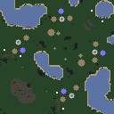](https://ashleynewson.github.io/openra-map-generator/version-20240603/?settings=eyJzZWVkIjo3OTc5NjU2MjAsInNpemUiOjEyOCwicm90YXRpb25zIjoxLCJtaXJyb3IiOjQsInBsYXllcnMiOjIsImN1c3RvbU5hbWUiOiIiLCJ3YXZlbGVuZ3RoU2NhbGUiOjAuMiwid2F0ZXIiOjAuMiwibW91bnRhaW5zIjowLjEsImZvcmVzdHMiOjAuMDI1LCJleHRlcm5hbENpcmN1bGFyQmlhcyI6MCwidGVycmFpblNtb290aGluZyI6NCwic21vb3RoaW5nVGhyZXNob2xkIjowLjMzLCJtaW5pbXVtTGFuZFNlYVRoaWNrbmVzcyI6NSwibWluaW11bU1vdW50YWluVGhpY2tuZXNzIjo1LCJtYXhpbXVtQWx0aXR1ZGUiOjgsInJvdWdobmVzc1JhZGl1cyI6NSwicm91Z2huZXNzIjowLjUsIm1pbmltdW1UZXJyYWluQ29udG91clNwYWNpbmciOjYsIm1pbmltdW1DbGlmZkxlbmd0aCI6MTAsImZvcmVzdENsdW1waW5lc3MiOjAuNSwiZGVueVdhbGxlZEFyZWFzIjp0cnVlLCJlbmZvcmNlU3ltbWV0cnkiOmZhbHNlLCJjcmVhdGVFbnRpdGllcyI6dHJ1ZSwic3RhcnRpbmdNaW5lcyI6Mywic3RhcnRpbmdPcmUiOjMsImNlbnRyYWxSZXNlcnZhdGlvbiI6MTYsInNwYXduUmVnaW9uU2l6ZSI6MTYsInNwYXduQnVpbGRTaXplIjo4LCJzcGF3bk1pbmVzIjozLCJzcGF3bk9yZSI6MywibWF4aW11bUV4cGFuc2lvbnMiOjQsIm1pbmltdW1FeHBhbnNpb25TaXplIjoyLCJtYXhpbXVtRXhwYW5zaW9uU2l6ZSI6MTIsImV4cGFuc2lvbklubmVyIjo0LCJleHBhbnNpb25Cb3JkZXIiOjQsImV4cGFuc2lvbk1pbmVzIjowLjAyLCJleHBhbnNpb25PcmUiOjUsImdlbVVwZ3JhZGUiOjAuMSwibWluaW11bUJ1aWxkaW5ncyI6MCwibWF4aW11bUJ1aWxkaW5ncyI6Mywid2VpZ2h0RmNvbSI6MSwid2VpZ2h0SG9zcCI6Miwid2VpZ2h0TWlzcyI6Miwid2VpZ2h0QmlvIjowLCJ3ZWlnaHRPaWxiIjo4fQ==)

### Rotate and mirror

You were ready to play a 2v2, but two more friends showed up? No problem. Make it a 2v2v2!

[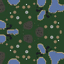](https://ashleynewson.github.io/openra-map-generator/version-20240603/?settings=eyJzZWVkIjoxOTMzNDcyMjU5LCJzaXplIjoxMjgsInJvdGF0aW9ucyI6MywibWlycm9yIjoxLCJwbGF5ZXJzIjoxLCJjdXN0b21OYW1lIjoiIiwid2F2ZWxlbmd0aFNjYWxlIjowLjIsIndhdGVyIjowLjIsIm1vdW50YWlucyI6MC4xLCJmb3Jlc3RzIjowLjAyNSwiZXh0ZXJuYWxDaXJjdWxhckJpYXMiOjAsInRlcnJhaW5TbW9vdGhpbmciOjQsInNtb290aGluZ1RocmVzaG9sZCI6MC4zMywibWluaW11bUxhbmRTZWFUaGlja25lc3MiOjUsIm1pbmltdW1Nb3VudGFpblRoaWNrbmVzcyI6NSwibWF4aW11bUFsdGl0dWRlIjo4LCJyb3VnaG5lc3NSYWRpdXMiOjUsInJvdWdobmVzcyI6MSwibWluaW11bVRlcnJhaW5Db250b3VyU3BhY2luZyI6NiwibWluaW11bUNsaWZmTGVuZ3RoIjoxMCwiZm9yZXN0Q2x1bXBpbmVzcyI6MC41LCJkZW55V2FsbGVkQXJlYXMiOnRydWUsImVuZm9yY2VTeW1tZXRyeSI6ZmFsc2UsImNyZWF0ZUVudGl0aWVzIjp0cnVlLCJzdGFydGluZ01pbmVzIjozLCJzdGFydGluZ09yZSI6MywiY2VudHJhbFJlc2VydmF0aW9uIjoxNiwic3Bhd25SZWdpb25TaXplIjoxNiwic3Bhd25CdWlsZFNpemUiOjgsInNwYXduTWluZXMiOjMsInNwYXduT3JlIjozLCJtYXhpbXVtRXhwYW5zaW9ucyI6NCwibWluaW11bUV4cGFuc2lvblNpemUiOjIsIm1heGltdW1FeHBhbnNpb25TaXplIjoxMiwiZXhwYW5zaW9uSW5uZXIiOjQsImV4cGFuc2lvbkJvcmRlciI6NCwiZXhwYW5zaW9uTWluZXMiOjAuMDIsImV4cGFuc2lvbk9yZSI6NSwiZ2VtVXBncmFkZSI6MC4xLCJtaW5pbXVtQnVpbGRpbmdzIjowLCJtYXhpbXVtQnVpbGRpbmdzIjozLCJ3ZWlnaHRGY29tIjoxLCJ3ZWlnaHRIb3NwIjoyLCJ3ZWlnaHRNaXNzIjoyLCJ3ZWlnaHRCaW8iOjAsIndlaWdodE9pbGIiOjh9)

### Circular maps

Don't like squares? Make it a circle.

[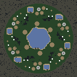](https://ashleynewson.github.io/openra-map-generator/version-20240603/?settings=eyJzZWVkIjo1MTYxMjY1NzcsInNpemUiOjEyOCwicm90YXRpb25zIjo2LCJtaXJyb3IiOjAsInBsYXllcnMiOjEsImN1c3RvbU5hbWUiOiIiLCJ3YXZlbGVuZ3RoU2NhbGUiOjAuMiwid2F0ZXIiOjAuMiwibW91bnRhaW5zIjowLjEsImZvcmVzdHMiOjAuMDI1LCJleHRlcm5hbENpcmN1bGFyQmlhcyI6MSwidGVycmFpblNtb290aGluZyI6NCwic21vb3RoaW5nVGhyZXNob2xkIjowLjMzLCJtaW5pbXVtTGFuZFNlYVRoaWNrbmVzcyI6NSwibWluaW11bU1vdW50YWluVGhpY2tuZXNzIjo1LCJtYXhpbXVtQWx0aXR1ZGUiOjgsInJvdWdobmVzc1JhZGl1cyI6NSwicm91Z2huZXNzIjowLjUsIm1pbmltdW1UZXJyYWluQ29udG91clNwYWNpbmciOjYsIm1pbmltdW1DbGlmZkxlbmd0aCI6MTAsImZvcmVzdENsdW1waW5lc3MiOjAuNSwiZGVueVdhbGxlZEFyZWFzIjp0cnVlLCJlbmZvcmNlU3ltbWV0cnkiOmZhbHNlLCJjcmVhdGVFbnRpdGllcyI6dHJ1ZSwic3RhcnRpbmdNaW5lcyI6Mywic3RhcnRpbmdPcmUiOjMsImNlbnRyYWxSZXNlcnZhdGlvbiI6MTYsInNwYXduUmVnaW9uU2l6ZSI6MTYsInNwYXduQnVpbGRTaXplIjo4LCJzcGF3bk1pbmVzIjozLCJzcGF3bk9yZSI6MywibWF4aW11bUV4cGFuc2lvbnMiOjQsIm1pbmltdW1FeHBhbnNpb25TaXplIjoyLCJtYXhpbXVtRXhwYW5zaW9uU2l6ZSI6MTIsImV4cGFuc2lvbklubmVyIjo0LCJleHBhbnNpb25Cb3JkZXIiOjQsImV4cGFuc2lvbk1pbmVzIjowLjAyLCJleHBhbnNpb25PcmUiOjUsImdlbVVwZ3JhZGUiOjAuMSwibWluaW11bUJ1aWxkaW5ncyI6MCwibWF4aW11bUJ1aWxkaW5ncyI6Mywid2VpZ2h0RmNvbSI6MSwid2VpZ2h0SG9zcCI6Miwid2VpZ2h0TWlzcyI6Miwid2VpZ2h0QmlvIjowLCJ3ZWlnaHRPaWxiIjo4fQ==) [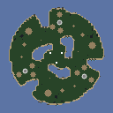](https://ashleynewson.github.io/openra-map-generator/version-20240603/?settings=eyJzZWVkIjotNTMzNDA3MjQ0LCJzaXplIjoxMjgsInJvdGF0aW9ucyI6MywibWlycm9yIjowLCJwbGF5ZXJzIjoxLCJjdXN0b21OYW1lIjoiIiwid2F2ZWxlbmd0aFNjYWxlIjowLjIsIndhdGVyIjowLjIsIm1vdW50YWlucyI6MC4xLCJmb3Jlc3RzIjowLjAyNSwiZXh0ZXJuYWxDaXJjdWxhckJpYXMiOi0xLCJ0ZXJyYWluU21vb3RoaW5nIjo0LCJzbW9vdGhpbmdUaHJlc2hvbGQiOjAuMzMsIm1pbmltdW1MYW5kU2VhVGhpY2tuZXNzIjo1LCJtaW5pbXVtTW91bnRhaW5UaGlja25lc3MiOjUsIm1heGltdW1BbHRpdHVkZSI6OCwicm91Z2huZXNzUmFkaXVzIjo1LCJyb3VnaG5lc3MiOjAuNSwibWluaW11bVRlcnJhaW5Db250b3VyU3BhY2luZyI6NiwibWluaW11bUNsaWZmTGVuZ3RoIjoxMCwiZm9yZXN0Q2x1bXBpbmVzcyI6MC41LCJkZW55V2FsbGVkQXJlYXMiOnRydWUsImVuZm9yY2VTeW1tZXRyeSI6ZmFsc2UsImNyZWF0ZUVudGl0aWVzIjp0cnVlLCJzdGFydGluZ01pbmVzIjozLCJzdGFydGluZ09yZSI6MywiY2VudHJhbFJlc2VydmF0aW9uIjoxNiwic3Bhd25SZWdpb25TaXplIjoxNiwic3Bhd25CdWlsZFNpemUiOjgsInNwYXduTWluZXMiOjMsInNwYXduT3JlIjozLCJtYXhpbXVtRXhwYW5zaW9ucyI6NCwibWluaW11bUV4cGFuc2lvblNpemUiOjIsIm1heGltdW1FeHBhbnNpb25TaXplIjoxMiwiZXhwYW5zaW9uSW5uZXIiOjQsImV4cGFuc2lvbkJvcmRlciI6NCwiZXhwYW5zaW9uTWluZXMiOjAuMDIsImV4cGFuc2lvbk9yZSI6NSwiZ2VtVXBncmFkZSI6MC4xLCJtaW5pbXVtQnVpbGRpbmdzIjowLCJtYXhpbXVtQnVpbGRpbmdzIjozLCJ3ZWlnaHRGY29tIjoxLCJ3ZWlnaHRIb3NwIjoyLCJ3ZWlnaHRNaXNzIjoyLCJ3ZWlnaHRCaW8iOjAsIndlaWdodE9pbGIiOjh9)

### Asymmetry

If you're looking for chaos and aren't going to argue about who gets which spawn, you can play a massive asymmetric map. I won't stop you. ;)

[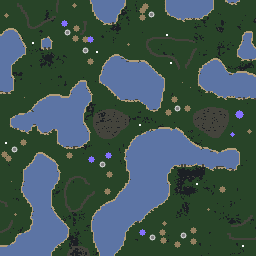](https://ashleynewson.github.io/openra-map-generator/version-20240603/?settings=eyJzZWVkIjotMTU2MDY0Njg5Nywic2l6ZSI6MjU2LCJyb3RhdGlvbnMiOjEsIm1pcnJvciI6MCwicGxheWVycyI6OCwiY3VzdG9tTmFtZSI6IiIsIndhdmVsZW5ndGhTY2FsZSI6MC4yLCJ3YXRlciI6MC4zLCJtb3VudGFpbnMiOjAuMTUsImZvcmVzdHMiOjAuMDUsImV4dGVybmFsQ2lyY3VsYXJCaWFzIjowLCJ0ZXJyYWluU21vb3RoaW5nIjo0LCJzbW9vdGhpbmdUaHJlc2hvbGQiOjAuMzMsIm1pbmltdW1MYW5kU2VhVGhpY2tuZXNzIjo1LCJtaW5pbXVtTW91bnRhaW5UaGlja25lc3MiOjUsIm1heGltdW1BbHRpdHVkZSI6OCwicm91Z2huZXNzUmFkaXVzIjo1LCJyb3VnaG5lc3MiOjAuNSwibWluaW11bVRlcnJhaW5Db250b3VyU3BhY2luZyI6NiwibWluaW11bUNsaWZmTGVuZ3RoIjoxMCwiZm9yZXN0Q2x1bXBpbmVzcyI6MC4yNSwiZGVueVdhbGxlZEFyZWFzIjp0cnVlLCJlbmZvcmNlU3ltbWV0cnkiOmZhbHNlLCJjcmVhdGVFbnRpdGllcyI6dHJ1ZSwic3RhcnRpbmdNaW5lcyI6Mywic3RhcnRpbmdPcmUiOjMsImNlbnRyYWxSZXNlcnZhdGlvbiI6MTYsInNwYXduUmVnaW9uU2l6ZSI6MTYsInNwYXduQnVpbGRTaXplIjo4LCJzcGF3bk1pbmVzIjozLCJzcGF3bk9yZSI6MywibWF4aW11bUV4cGFuc2lvbnMiOjE2LCJtaW5pbXVtRXhwYW5zaW9uU2l6ZSI6MiwibWF4aW11bUV4cGFuc2lvblNpemUiOjEyLCJleHBhbnNpb25Jbm5lciI6NCwiZXhwYW5zaW9uQm9yZGVyIjo0LCJleHBhbnNpb25NaW5lcyI6MC4wMiwiZXhwYW5zaW9uT3JlIjo1LCJnZW1VcGdyYWRlIjowLjEsIm1pbmltdW1CdWlsZGluZ3MiOjgsIm1heGltdW1CdWlsZGluZ3MiOjgsIndlaWdodEZjb20iOjEsIndlaWdodEhvc3AiOjIsIndlaWdodE1pc3MiOjIsIndlaWdodEJpbyI6MCwid2VpZ2h0T2lsYiI6OH0=)

## Terrain presets

Map generation parameters can be adjusted to alter the quantities and spacing of certain terrain features and actors. A few presets are offered which demonstrate various terrain generation features.

### Plains

Largely open spaces

[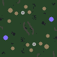](https://ashleynewson.github.io/openra-map-generator/version-20240603/?settings=eyJzZWVkIjotMTUxODY1MTIwNywic2l6ZSI6OTYsInJvdGF0aW9ucyI6MiwibWlycm9yIjowLCJwbGF5ZXJzIjoxLCJjdXN0b21OYW1lIjoiIiwid2F2ZWxlbmd0aFNjYWxlIjowLjIsIndhdGVyIjowLCJtb3VudGFpbnMiOjAuMSwiZm9yZXN0cyI6MC4wMjUsImV4dGVybmFsQ2lyY3VsYXJCaWFzIjowLCJ0ZXJyYWluU21vb3RoaW5nIjo0LCJzbW9vdGhpbmdUaHJlc2hvbGQiOjAuMzMsIm1pbmltdW1MYW5kU2VhVGhpY2tuZXNzIjo1LCJtaW5pbXVtTW91bnRhaW5UaGlja25lc3MiOjUsIm1heGltdW1BbHRpdHVkZSI6OCwicm91Z2huZXNzUmFkaXVzIjo1LCJyb3VnaG5lc3MiOjAuNSwibWluaW11bVRlcnJhaW5Db250b3VyU3BhY2luZyI6NiwibWluaW11bUNsaWZmTGVuZ3RoIjoxMCwiZm9yZXN0Q2x1bXBpbmVzcyI6MC41LCJkZW55V2FsbGVkQXJlYXMiOnRydWUsImVuZm9yY2VTeW1tZXRyeSI6ZmFsc2UsImNyZWF0ZUVudGl0aWVzIjp0cnVlLCJzdGFydGluZ01pbmVzIjozLCJzdGFydGluZ09yZSI6MywiY2VudHJhbFJlc2VydmF0aW9uIjoxNiwic3Bhd25SZWdpb25TaXplIjoxNiwic3Bhd25CdWlsZFNpemUiOjgsInNwYXduTWluZXMiOjMsInNwYXduT3JlIjozLCJtYXhpbXVtRXhwYW5zaW9ucyI6NCwibWluaW11bUV4cGFuc2lvblNpemUiOjIsIm1heGltdW1FeHBhbnNpb25TaXplIjoxMiwiZXhwYW5zaW9uSW5uZXIiOjQsImV4cGFuc2lvbkJvcmRlciI6NCwiZXhwYW5zaW9uTWluZXMiOjAuMDIsImV4cGFuc2lvbk9yZSI6NSwiZ2VtVXBncmFkZSI6MC4xLCJtaW5pbXVtQnVpbGRpbmdzIjowLCJtYXhpbXVtQnVpbGRpbmdzIjozLCJ3ZWlnaHRGY29tIjoxLCJ3ZWlnaHRIb3NwIjoyLCJ3ZWlnaHRNaXNzIjoyLCJ3ZWlnaHRCaW8iOjAsIndlaWdodE9pbGIiOjh9) [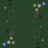](https://ashleynewson.github.io/openra-map-generator/version-20240603/?settings=eyJzZWVkIjo4ODU1OTE0NjcsInNpemUiOjk2LCJyb3RhdGlvbnMiOjIsIm1pcnJvciI6MCwicGxheWVycyI6MSwiY3VzdG9tTmFtZSI6IiIsIndhdmVsZW5ndGhTY2FsZSI6MC4yLCJ3YXRlciI6MCwibW91bnRhaW5zIjowLjEsImZvcmVzdHMiOjAuMDI1LCJleHRlcm5hbENpcmN1bGFyQmlhcyI6MCwidGVycmFpblNtb290aGluZyI6NCwic21vb3RoaW5nVGhyZXNob2xkIjowLjMzLCJtaW5pbXVtTGFuZFNlYVRoaWNrbmVzcyI6NSwibWluaW11bU1vdW50YWluVGhpY2tuZXNzIjo1LCJtYXhpbXVtQWx0aXR1ZGUiOjgsInJvdWdobmVzc1JhZGl1cyI6NSwicm91Z2huZXNzIjowLjUsIm1pbmltdW1UZXJyYWluQ29udG91clNwYWNpbmciOjYsIm1pbmltdW1DbGlmZkxlbmd0aCI6MTAsImZvcmVzdENsdW1waW5lc3MiOjAuNSwiZGVueVdhbGxlZEFyZWFzIjp0cnVlLCJlbmZvcmNlU3ltbWV0cnkiOmZhbHNlLCJjcmVhdGVFbnRpdGllcyI6dHJ1ZSwic3RhcnRpbmdNaW5lcyI6Mywic3RhcnRpbmdPcmUiOjMsImNlbnRyYWxSZXNlcnZhdGlvbiI6MTYsInNwYXduUmVnaW9uU2l6ZSI6MTYsInNwYXduQnVpbGRTaXplIjo4LCJzcGF3bk1pbmVzIjozLCJzcGF3bk9yZSI6MywibWF4aW11bUV4cGFuc2lvbnMiOjQsIm1pbmltdW1FeHBhbnNpb25TaXplIjoyLCJtYXhpbXVtRXhwYW5zaW9uU2l6ZSI6MTIsImV4cGFuc2lvbklubmVyIjo0LCJleHBhbnNpb25Cb3JkZXIiOjQsImV4cGFuc2lvbk1pbmVzIjowLjAyLCJleHBhbnNpb25PcmUiOjUsImdlbVVwZ3JhZGUiOjAuMSwibWluaW11bUJ1aWxkaW5ncyI6MCwibWF4aW11bUJ1aWxkaW5ncyI6Mywid2VpZ2h0RmNvbSI6MSwid2VpZ2h0SG9zcCI6Miwid2VpZ2h0TWlzcyI6Miwid2VpZ2h0QmlvIjowLCJ3ZWlnaHRPaWxiIjo4fQ==) [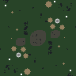](https://ashleynewson.github.io/openra-map-generator/version-20240603/?settings=eyJzZWVkIjotMTcxMDE4Mjg2NCwic2l6ZSI6OTYsInJvdGF0aW9ucyI6MiwibWlycm9yIjowLCJwbGF5ZXJzIjoxLCJjdXN0b21OYW1lIjoiIiwid2F2ZWxlbmd0aFNjYWxlIjowLjIsIndhdGVyIjowLCJtb3VudGFpbnMiOjAuMSwiZm9yZXN0cyI6MC4wMjUsImV4dGVybmFsQ2lyY3VsYXJCaWFzIjowLCJ0ZXJyYWluU21vb3RoaW5nIjo0LCJzbW9vdGhpbmdUaHJlc2hvbGQiOjAuMzMsIm1pbmltdW1MYW5kU2VhVGhpY2tuZXNzIjo1LCJtaW5pbXVtTW91bnRhaW5UaGlja25lc3MiOjUsIm1heGltdW1BbHRpdHVkZSI6OCwicm91Z2huZXNzUmFkaXVzIjo1LCJyb3VnaG5lc3MiOjAuNSwibWluaW11bVRlcnJhaW5Db250b3VyU3BhY2luZyI6NiwibWluaW11bUNsaWZmTGVuZ3RoIjoxMCwiZm9yZXN0Q2x1bXBpbmVzcyI6MC41LCJkZW55V2FsbGVkQXJlYXMiOnRydWUsImVuZm9yY2VTeW1tZXRyeSI6ZmFsc2UsImNyZWF0ZUVudGl0aWVzIjp0cnVlLCJzdGFydGluZ01pbmVzIjozLCJzdGFydGluZ09yZSI6MywiY2VudHJhbFJlc2VydmF0aW9uIjoxNiwic3Bhd25SZWdpb25TaXplIjoxNiwic3Bhd25CdWlsZFNpemUiOjgsInNwYXduTWluZXMiOjMsInNwYXduT3JlIjozLCJtYXhpbXVtRXhwYW5zaW9ucyI6NCwibWluaW11bUV4cGFuc2lvblNpemUiOjIsIm1heGltdW1FeHBhbnNpb25TaXplIjoxMiwiZXhwYW5zaW9uSW5uZXIiOjQsImV4cGFuc2lvbkJvcmRlciI6NCwiZXhwYW5zaW9uTWluZXMiOjAuMDIsImV4cGFuc2lvbk9yZSI6NSwiZ2VtVXBncmFkZSI6MC4xLCJtaW5pbXVtQnVpbGRpbmdzIjowLCJtYXhpbXVtQnVpbGRpbmdzIjozLCJ3ZWlnaHRGY29tIjoxLCJ3ZWlnaHRIb3NwIjoyLCJ3ZWlnaHRNaXNzIjoyLCJ3ZWlnaHRCaW8iOjAsIndlaWdodE9pbGIiOjh9)

[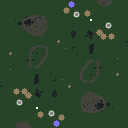](https://ashleynewson.github.io/openra-map-generator/version-20240603/?settings=eyJzZWVkIjoyNjQwNDI2MTksInNpemUiOjEyOCwicm90YXRpb25zIjoyLCJtaXJyb3IiOjAsInBsYXllcnMiOjIsImN1c3RvbU5hbWUiOiIiLCJ3YXZlbGVuZ3RoU2NhbGUiOjAuMiwid2F0ZXIiOjAsIm1vdW50YWlucyI6MC4xLCJmb3Jlc3RzIjowLjAyNSwiZXh0ZXJuYWxDaXJjdWxhckJpYXMiOjAsInRlcnJhaW5TbW9vdGhpbmciOjQsInNtb290aGluZ1RocmVzaG9sZCI6MC4zMywibWluaW11bUxhbmRTZWFUaGlja25lc3MiOjUsIm1pbmltdW1Nb3VudGFpblRoaWNrbmVzcyI6NSwibWF4aW11bUFsdGl0dWRlIjo4LCJyb3VnaG5lc3NSYWRpdXMiOjUsInJvdWdobmVzcyI6MC41LCJtaW5pbXVtVGVycmFpbkNvbnRvdXJTcGFjaW5nIjo2LCJtaW5pbXVtQ2xpZmZMZW5ndGgiOjEwLCJmb3Jlc3RDbHVtcGluZXNzIjowLjUsImRlbnlXYWxsZWRBcmVhcyI6dHJ1ZSwiZW5mb3JjZVN5bW1ldHJ5IjpmYWxzZSwiY3JlYXRlRW50aXRpZXMiOnRydWUsInN0YXJ0aW5nTWluZXMiOjMsInN0YXJ0aW5nT3JlIjozLCJjZW50cmFsUmVzZXJ2YXRpb24iOjE2LCJzcGF3blJlZ2lvblNpemUiOjE2LCJzcGF3bkJ1aWxkU2l6ZSI6OCwic3Bhd25NaW5lcyI6Mywic3Bhd25PcmUiOjMsIm1heGltdW1FeHBhbnNpb25zIjo0LCJtaW5pbXVtRXhwYW5zaW9uU2l6ZSI6MiwibWF4aW11bUV4cGFuc2lvblNpemUiOjEyLCJleHBhbnNpb25Jbm5lciI6NCwiZXhwYW5zaW9uQm9yZGVyIjo0LCJleHBhbnNpb25NaW5lcyI6MC4wMiwiZXhwYW5zaW9uT3JlIjo1LCJnZW1VcGdyYWRlIjowLjEsIm1pbmltdW1CdWlsZGluZ3MiOjAsIm1heGltdW1CdWlsZGluZ3MiOjMsIndlaWdodEZjb20iOjEsIndlaWdodEhvc3AiOjIsIndlaWdodE1pc3MiOjIsIndlaWdodEJpbyI6MCwid2VpZ2h0T2lsYiI6OH0=) [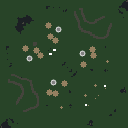](https://ashleynewson.github.io/openra-map-generator/version-20240603/?settings=eyJzZWVkIjoxNTUzNjc1NDEzLCJzaXplIjoxMjgsInJvdGF0aW9ucyI6MSwibWlycm9yIjoyLCJwbGF5ZXJzIjoyLCJjdXN0b21OYW1lIjoiIiwid2F2ZWxlbmd0aFNjYWxlIjowLjIsIndhdGVyIjowLCJtb3VudGFpbnMiOjAuMSwiZm9yZXN0cyI6MC4wMjUsImV4dGVybmFsQ2lyY3VsYXJCaWFzIjowLCJ0ZXJyYWluU21vb3RoaW5nIjo0LCJzbW9vdGhpbmdUaHJlc2hvbGQiOjAuMzMsIm1pbmltdW1MYW5kU2VhVGhpY2tuZXNzIjo1LCJtaW5pbXVtTW91bnRhaW5UaGlja25lc3MiOjUsIm1heGltdW1BbHRpdHVkZSI6OCwicm91Z2huZXNzUmFkaXVzIjo1LCJyb3VnaG5lc3MiOjAuNSwibWluaW11bVRlcnJhaW5Db250b3VyU3BhY2luZyI6NiwibWluaW11bUNsaWZmTGVuZ3RoIjoxMCwiZm9yZXN0Q2x1bXBpbmVzcyI6MC41LCJkZW55V2FsbGVkQXJlYXMiOnRydWUsImVuZm9yY2VTeW1tZXRyeSI6ZmFsc2UsImNyZWF0ZUVudGl0aWVzIjp0cnVlLCJzdGFydGluZ01pbmVzIjozLCJzdGFydGluZ09yZSI6MywiY2VudHJhbFJlc2VydmF0aW9uIjoxNiwic3Bhd25SZWdpb25TaXplIjoxNiwic3Bhd25CdWlsZFNpemUiOjgsInNwYXduTWluZXMiOjMsInNwYXduT3JlIjozLCJtYXhpbXVtRXhwYW5zaW9ucyI6NCwibWluaW11bUV4cGFuc2lvblNpemUiOjIsIm1heGltdW1FeHBhbnNpb25TaXplIjoxMiwiZXhwYW5zaW9uSW5uZXIiOjQsImV4cGFuc2lvbkJvcmRlciI6NCwiZXhwYW5zaW9uTWluZXMiOjAuMDIsImV4cGFuc2lvbk9yZSI6NSwiZ2VtVXBncmFkZSI6MC4xLCJtaW5pbXVtQnVpbGRpbmdzIjowLCJtYXhpbXVtQnVpbGRpbmdzIjozLCJ3ZWlnaHRGY29tIjoxLCJ3ZWlnaHRIb3NwIjoyLCJ3ZWlnaHRNaXNzIjoyLCJ3ZWlnaHRCaW8iOjAsIndlaWdodE9pbGIiOjh9)

### Woodlands

You could get lost in there...

[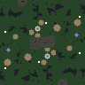](https://ashleynewson.github.io/openra-map-generator/version-20240603/?settings=eyJzZWVkIjoxMTU0MzcyMzkzLCJzaXplIjo5Niwicm90YXRpb25zIjoyLCJtaXJyb3IiOjAsInBsYXllcnMiOjEsImN1c3RvbU5hbWUiOiIiLCJ3YXZlbGVuZ3RoU2NhbGUiOjAuMiwid2F0ZXIiOjAsIm1vdW50YWlucyI6MC4xLCJmb3Jlc3RzIjowLjEsImV4dGVybmFsQ2lyY3VsYXJCaWFzIjowLCJ0ZXJyYWluU21vb3RoaW5nIjo0LCJzbW9vdGhpbmdUaHJlc2hvbGQiOjAuMzMsIm1pbmltdW1MYW5kU2VhVGhpY2tuZXNzIjo1LCJtaW5pbXVtTW91bnRhaW5UaGlja25lc3MiOjUsIm1heGltdW1BbHRpdHVkZSI6OCwicm91Z2huZXNzUmFkaXVzIjo1LCJyb3VnaG5lc3MiOjAuNSwibWluaW11bVRlcnJhaW5Db250b3VyU3BhY2luZyI6NiwibWluaW11bUNsaWZmTGVuZ3RoIjoxMCwiZm9yZXN0Q2x1bXBpbmVzcyI6MC41LCJkZW55V2FsbGVkQXJlYXMiOnRydWUsImVuZm9yY2VTeW1tZXRyeSI6ZmFsc2UsImNyZWF0ZUVudGl0aWVzIjp0cnVlLCJzdGFydGluZ01pbmVzIjozLCJzdGFydGluZ09yZSI6MywiY2VudHJhbFJlc2VydmF0aW9uIjoxNiwic3Bhd25SZWdpb25TaXplIjoxNiwic3Bhd25CdWlsZFNpemUiOjgsInNwYXduTWluZXMiOjMsInNwYXduT3JlIjozLCJtYXhpbXVtRXhwYW5zaW9ucyI6NCwibWluaW11bUV4cGFuc2lvblNpemUiOjIsIm1heGltdW1FeHBhbnNpb25TaXplIjoxMiwiZXhwYW5zaW9uSW5uZXIiOjQsImV4cGFuc2lvbkJvcmRlciI6NCwiZXhwYW5zaW9uTWluZXMiOjAuMDIsImV4cGFuc2lvbk9yZSI6NSwiZ2VtVXBncmFkZSI6MC4xLCJtaW5pbXVtQnVpbGRpbmdzIjowLCJtYXhpbXVtQnVpbGRpbmdzIjozLCJ3ZWlnaHRGY29tIjoxLCJ3ZWlnaHRIb3NwIjoyLCJ3ZWlnaHRNaXNzIjoyLCJ3ZWlnaHRCaW8iOjAsIndlaWdodE9pbGIiOjh9) [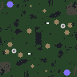](https://ashleynewson.github.io/openra-map-generator/version-20240603/?settings=eyJzZWVkIjotMzAwMzU0OTc1LCJzaXplIjo5Niwicm90YXRpb25zIjoyLCJtaXJyb3IiOjAsInBsYXllcnMiOjEsImN1c3RvbU5hbWUiOiIiLCJ3YXZlbGVuZ3RoU2NhbGUiOjAuMiwid2F0ZXIiOjAsIm1vdW50YWlucyI6MC4xLCJmb3Jlc3RzIjowLjEsImV4dGVybmFsQ2lyY3VsYXJCaWFzIjowLCJ0ZXJyYWluU21vb3RoaW5nIjo0LCJzbW9vdGhpbmdUaHJlc2hvbGQiOjAuMzMsIm1pbmltdW1MYW5kU2VhVGhpY2tuZXNzIjo1LCJtaW5pbXVtTW91bnRhaW5UaGlja25lc3MiOjUsIm1heGltdW1BbHRpdHVkZSI6OCwicm91Z2huZXNzUmFkaXVzIjo1LCJyb3VnaG5lc3MiOjAuNSwibWluaW11bVRlcnJhaW5Db250b3VyU3BhY2luZyI6NiwibWluaW11bUNsaWZmTGVuZ3RoIjoxMCwiZm9yZXN0Q2x1bXBpbmVzcyI6MC41LCJkZW55V2FsbGVkQXJlYXMiOnRydWUsImVuZm9yY2VTeW1tZXRyeSI6ZmFsc2UsImNyZWF0ZUVudGl0aWVzIjp0cnVlLCJzdGFydGluZ01pbmVzIjozLCJzdGFydGluZ09yZSI6MywiY2VudHJhbFJlc2VydmF0aW9uIjoxNiwic3Bhd25SZWdpb25TaXplIjoxNiwic3Bhd25CdWlsZFNpemUiOjgsInNwYXduTWluZXMiOjMsInNwYXduT3JlIjozLCJtYXhpbXVtRXhwYW5zaW9ucyI6NCwibWluaW11bUV4cGFuc2lvblNpemUiOjIsIm1heGltdW1FeHBhbnNpb25TaXplIjoxMiwiZXhwYW5zaW9uSW5uZXIiOjQsImV4cGFuc2lvbkJvcmRlciI6NCwiZXhwYW5zaW9uTWluZXMiOjAuMDIsImV4cGFuc2lvbk9yZSI6NSwiZ2VtVXBncmFkZSI6MC4xLCJtaW5pbXVtQnVpbGRpbmdzIjowLCJtYXhpbXVtQnVpbGRpbmdzIjozLCJ3ZWlnaHRGY29tIjoxLCJ3ZWlnaHRIb3NwIjoyLCJ3ZWlnaHRNaXNzIjoyLCJ3ZWlnaHRCaW8iOjAsIndlaWdodE9pbGIiOjh9) [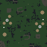](https://ashleynewson.github.io/openra-map-generator/version-20240603/?settings=eyJzZWVkIjotMjk2NzcxNTkwLCJzaXplIjo5Niwicm90YXRpb25zIjoyLCJtaXJyb3IiOjAsInBsYXllcnMiOjEsImN1c3RvbU5hbWUiOiIiLCJ3YXZlbGVuZ3RoU2NhbGUiOjAuMiwid2F0ZXIiOjAsIm1vdW50YWlucyI6MC4xLCJmb3Jlc3RzIjowLjEsImV4dGVybmFsQ2lyY3VsYXJCaWFzIjowLCJ0ZXJyYWluU21vb3RoaW5nIjo0LCJzbW9vdGhpbmdUaHJlc2hvbGQiOjAuMzMsIm1pbmltdW1MYW5kU2VhVGhpY2tuZXNzIjo1LCJtaW5pbXVtTW91bnRhaW5UaGlja25lc3MiOjUsIm1heGltdW1BbHRpdHVkZSI6OCwicm91Z2huZXNzUmFkaXVzIjo1LCJyb3VnaG5lc3MiOjAuNSwibWluaW11bVRlcnJhaW5Db250b3VyU3BhY2luZyI6NiwibWluaW11bUNsaWZmTGVuZ3RoIjoxMCwiZm9yZXN0Q2x1bXBpbmVzcyI6MC41LCJkZW55V2FsbGVkQXJlYXMiOnRydWUsImVuZm9yY2VTeW1tZXRyeSI6ZmFsc2UsImNyZWF0ZUVudGl0aWVzIjp0cnVlLCJzdGFydGluZ01pbmVzIjozLCJzdGFydGluZ09yZSI6MywiY2VudHJhbFJlc2VydmF0aW9uIjoxNiwic3Bhd25SZWdpb25TaXplIjoxNiwic3Bhd25CdWlsZFNpemUiOjgsInNwYXduTWluZXMiOjMsInNwYXduT3JlIjozLCJtYXhpbXVtRXhwYW5zaW9ucyI6NCwibWluaW11bUV4cGFuc2lvblNpemUiOjIsIm1heGltdW1FeHBhbnNpb25TaXplIjoxMiwiZXhwYW5zaW9uSW5uZXIiOjQsImV4cGFuc2lvbkJvcmRlciI6NCwiZXhwYW5zaW9uTWluZXMiOjAuMDIsImV4cGFuc2lvbk9yZSI6NSwiZ2VtVXBncmFkZSI6MC4xLCJtaW5pbXVtQnVpbGRpbmdzIjowLCJtYXhpbXVtQnVpbGRpbmdzIjozLCJ3ZWlnaHRGY29tIjoxLCJ3ZWlnaHRIb3NwIjoyLCJ3ZWlnaHRNaXNzIjoyLCJ3ZWlnaHRCaW8iOjAsIndlaWdodE9pbGIiOjh9)

[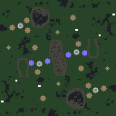](https://ashleynewson.github.io/openra-map-generator/version-20240603/?settings=eyJzZWVkIjoxOTk2NDk4OTM0LCJzaXplIjoxMjgsInJvdGF0aW9ucyI6MiwibWlycm9yIjowLCJwbGF5ZXJzIjoyLCJjdXN0b21OYW1lIjoiIiwid2F2ZWxlbmd0aFNjYWxlIjowLjIsIndhdGVyIjowLCJtb3VudGFpbnMiOjAuMSwiZm9yZXN0cyI6MC4xLCJleHRlcm5hbENpcmN1bGFyQmlhcyI6MCwidGVycmFpblNtb290aGluZyI6NCwic21vb3RoaW5nVGhyZXNob2xkIjowLjMzLCJtaW5pbXVtTGFuZFNlYVRoaWNrbmVzcyI6NSwibWluaW11bU1vdW50YWluVGhpY2tuZXNzIjo1LCJtYXhpbXVtQWx0aXR1ZGUiOjgsInJvdWdobmVzc1JhZGl1cyI6NSwicm91Z2huZXNzIjowLjUsIm1pbmltdW1UZXJyYWluQ29udG91clNwYWNpbmciOjYsIm1pbmltdW1DbGlmZkxlbmd0aCI6MTAsImZvcmVzdENsdW1waW5lc3MiOjAuNSwiZGVueVdhbGxlZEFyZWFzIjp0cnVlLCJlbmZvcmNlU3ltbWV0cnkiOmZhbHNlLCJjcmVhdGVFbnRpdGllcyI6dHJ1ZSwic3RhcnRpbmdNaW5lcyI6Mywic3RhcnRpbmdPcmUiOjMsImNlbnRyYWxSZXNlcnZhdGlvbiI6MTYsInNwYXduUmVnaW9uU2l6ZSI6MTYsInNwYXduQnVpbGRTaXplIjo4LCJzcGF3bk1pbmVzIjozLCJzcGF3bk9yZSI6MywibWF4aW11bUV4cGFuc2lvbnMiOjQsIm1pbmltdW1FeHBhbnNpb25TaXplIjoyLCJtYXhpbXVtRXhwYW5zaW9uU2l6ZSI6MTIsImV4cGFuc2lvbklubmVyIjo0LCJleHBhbnNpb25Cb3JkZXIiOjQsImV4cGFuc2lvbk1pbmVzIjowLjAyLCJleHBhbnNpb25PcmUiOjUsImdlbVVwZ3JhZGUiOjAuMSwibWluaW11bUJ1aWxkaW5ncyI6MCwibWF4aW11bUJ1aWxkaW5ncyI6Mywid2VpZ2h0RmNvbSI6MSwid2VpZ2h0SG9zcCI6Miwid2VpZ2h0TWlzcyI6Miwid2VpZ2h0QmlvIjowLCJ3ZWlnaHRPaWxiIjo4fQ==) [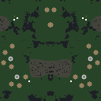](https://ashleynewson.github.io/openra-map-generator/version-20240603/?settings=eyJzZWVkIjo4NjQyOTM2OTUsInNpemUiOjEyOCwicm90YXRpb25zIjoxLCJtaXJyb3IiOjMsInBsYXllcnMiOjIsImN1c3RvbU5hbWUiOiIiLCJ3YXZlbGVuZ3RoU2NhbGUiOjAuMiwid2F0ZXIiOjAsIm1vdW50YWlucyI6MC4xLCJmb3Jlc3RzIjowLjEsImV4dGVybmFsQ2lyY3VsYXJCaWFzIjowLCJ0ZXJyYWluU21vb3RoaW5nIjo0LCJzbW9vdGhpbmdUaHJlc2hvbGQiOjAuMzMsIm1pbmltdW1MYW5kU2VhVGhpY2tuZXNzIjo1LCJtaW5pbXVtTW91bnRhaW5UaGlja25lc3MiOjUsIm1heGltdW1BbHRpdHVkZSI6OCwicm91Z2huZXNzUmFkaXVzIjo1LCJyb3VnaG5lc3MiOjAuNSwibWluaW11bVRlcnJhaW5Db250b3VyU3BhY2luZyI6NiwibWluaW11bUNsaWZmTGVuZ3RoIjoxMCwiZm9yZXN0Q2x1bXBpbmVzcyI6MC41LCJkZW55V2FsbGVkQXJlYXMiOnRydWUsImVuZm9yY2VTeW1tZXRyeSI6ZmFsc2UsImNyZWF0ZUVudGl0aWVzIjp0cnVlLCJzdGFydGluZ01pbmVzIjozLCJzdGFydGluZ09yZSI6MywiY2VudHJhbFJlc2VydmF0aW9uIjoxNiwic3Bhd25SZWdpb25TaXplIjoxNiwic3Bhd25CdWlsZFNpemUiOjgsInNwYXduTWluZXMiOjMsInNwYXduT3JlIjozLCJtYXhpbXVtRXhwYW5zaW9ucyI6NCwibWluaW11bUV4cGFuc2lvblNpemUiOjIsIm1heGltdW1FeHBhbnNpb25TaXplIjoxMiwiZXhwYW5zaW9uSW5uZXIiOjQsImV4cGFuc2lvbkJvcmRlciI6NCwiZXhwYW5zaW9uTWluZXMiOjAuMDIsImV4cGFuc2lvbk9yZSI6NSwiZ2VtVXBncmFkZSI6MC4xLCJtaW5pbXVtQnVpbGRpbmdzIjowLCJtYXhpbXVtQnVpbGRpbmdzIjozLCJ3ZWlnaHRGY29tIjoxLCJ3ZWlnaHRIb3NwIjoyLCJ3ZWlnaHRNaXNzIjoyLCJ3ZWlnaHRCaW8iOjAsIndlaWdodE9pbGIiOjh9)

### Mountains

Cliffs, cliffs, cliffs.

[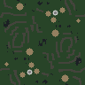](https://ashleynewson.github.io/openra-map-generator/version-20240603/?settings=eyJzZWVkIjoxMjQzODMxOTg2LCJzaXplIjo5Niwicm90YXRpb25zIjoyLCJtaXJyb3IiOjAsInBsYXllcnMiOjEsImN1c3RvbU5hbWUiOiIiLCJ3YXZlbGVuZ3RoU2NhbGUiOjAuMiwid2F0ZXIiOjAsIm1vdW50YWlucyI6MC45LCJmb3Jlc3RzIjowLjAyNSwiZXh0ZXJuYWxDaXJjdWxhckJpYXMiOjAsInRlcnJhaW5TbW9vdGhpbmciOjQsInNtb290aGluZ1RocmVzaG9sZCI6MC4zMywibWluaW11bUxhbmRTZWFUaGlja25lc3MiOjUsIm1pbmltdW1Nb3VudGFpblRoaWNrbmVzcyI6NSwibWF4aW11bUFsdGl0dWRlIjo4LCJyb3VnaG5lc3NSYWRpdXMiOjUsInJvdWdobmVzcyI6MC41LCJtaW5pbXVtVGVycmFpbkNvbnRvdXJTcGFjaW5nIjo2LCJtaW5pbXVtQ2xpZmZMZW5ndGgiOjEwLCJmb3Jlc3RDbHVtcGluZXNzIjowLjUsImRlbnlXYWxsZWRBcmVhcyI6dHJ1ZSwiZW5mb3JjZVN5bW1ldHJ5IjpmYWxzZSwiY3JlYXRlRW50aXRpZXMiOnRydWUsInN0YXJ0aW5nTWluZXMiOjMsInN0YXJ0aW5nT3JlIjozLCJjZW50cmFsUmVzZXJ2YXRpb24iOjE2LCJzcGF3blJlZ2lvblNpemUiOjE2LCJzcGF3bkJ1aWxkU2l6ZSI6OCwic3Bhd25NaW5lcyI6Mywic3Bhd25PcmUiOjMsIm1heGltdW1FeHBhbnNpb25zIjo0LCJtaW5pbXVtRXhwYW5zaW9uU2l6ZSI6MiwibWF4aW11bUV4cGFuc2lvblNpemUiOjEyLCJleHBhbnNpb25Jbm5lciI6NCwiZXhwYW5zaW9uQm9yZGVyIjo0LCJleHBhbnNpb25NaW5lcyI6MC4wMiwiZXhwYW5zaW9uT3JlIjo1LCJnZW1VcGdyYWRlIjowLjEsIm1pbmltdW1CdWlsZGluZ3MiOjAsIm1heGltdW1CdWlsZGluZ3MiOjMsIndlaWdodEZjb20iOjEsIndlaWdodEhvc3AiOjIsIndlaWdodE1pc3MiOjIsIndlaWdodEJpbyI6MCwid2VpZ2h0T2lsYiI6OH0=) [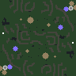](https://ashleynewson.github.io/openra-map-generator/version-20240603/?settings=eyJzZWVkIjoyODczMDMwMDYsInNpemUiOjk2LCJyb3RhdGlvbnMiOjIsIm1pcnJvciI6MCwicGxheWVycyI6MSwiY3VzdG9tTmFtZSI6IiIsIndhdmVsZW5ndGhTY2FsZSI6MC4yLCJ3YXRlciI6MCwibW91bnRhaW5zIjowLjksImZvcmVzdHMiOjAuMDI1LCJleHRlcm5hbENpcmN1bGFyQmlhcyI6MCwidGVycmFpblNtb290aGluZyI6NCwic21vb3RoaW5nVGhyZXNob2xkIjowLjMzLCJtaW5pbXVtTGFuZFNlYVRoaWNrbmVzcyI6NSwibWluaW11bU1vdW50YWluVGhpY2tuZXNzIjo1LCJtYXhpbXVtQWx0aXR1ZGUiOjgsInJvdWdobmVzc1JhZGl1cyI6NSwicm91Z2huZXNzIjowLjUsIm1pbmltdW1UZXJyYWluQ29udG91clNwYWNpbmciOjYsIm1pbmltdW1DbGlmZkxlbmd0aCI6MTAsImZvcmVzdENsdW1waW5lc3MiOjAuNSwiZGVueVdhbGxlZEFyZWFzIjp0cnVlLCJlbmZvcmNlU3ltbWV0cnkiOmZhbHNlLCJjcmVhdGVFbnRpdGllcyI6dHJ1ZSwic3RhcnRpbmdNaW5lcyI6Mywic3RhcnRpbmdPcmUiOjMsImNlbnRyYWxSZXNlcnZhdGlvbiI6MTYsInNwYXduUmVnaW9uU2l6ZSI6MTYsInNwYXduQnVpbGRTaXplIjo4LCJzcGF3bk1pbmVzIjozLCJzcGF3bk9yZSI6MywibWF4aW11bUV4cGFuc2lvbnMiOjQsIm1pbmltdW1FeHBhbnNpb25TaXplIjoyLCJtYXhpbXVtRXhwYW5zaW9uU2l6ZSI6MTIsImV4cGFuc2lvbklubmVyIjo0LCJleHBhbnNpb25Cb3JkZXIiOjQsImV4cGFuc2lvbk1pbmVzIjowLjAyLCJleHBhbnNpb25PcmUiOjUsImdlbVVwZ3JhZGUiOjAuMSwibWluaW11bUJ1aWxkaW5ncyI6MCwibWF4aW11bUJ1aWxkaW5ncyI6Mywid2VpZ2h0RmNvbSI6MSwid2VpZ2h0SG9zcCI6Miwid2VpZ2h0TWlzcyI6Miwid2VpZ2h0QmlvIjowLCJ3ZWlnaHRPaWxiIjo4fQ==) [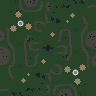](https://ashleynewson.github.io/openra-map-generator/version-20240603/?settings=eyJzZWVkIjoxNjE3Nzc0NDkyLCJzaXplIjo5Niwicm90YXRpb25zIjoyLCJtaXJyb3IiOjAsInBsYXllcnMiOjEsImN1c3RvbU5hbWUiOiIiLCJ3YXZlbGVuZ3RoU2NhbGUiOjAuMiwid2F0ZXIiOjAsIm1vdW50YWlucyI6MC45LCJmb3Jlc3RzIjowLjAyNSwiZXh0ZXJuYWxDaXJjdWxhckJpYXMiOjAsInRlcnJhaW5TbW9vdGhpbmciOjQsInNtb290aGluZ1RocmVzaG9sZCI6MC4zMywibWluaW11bUxhbmRTZWFUaGlja25lc3MiOjUsIm1pbmltdW1Nb3VudGFpblRoaWNrbmVzcyI6NSwibWF4aW11bUFsdGl0dWRlIjo4LCJyb3VnaG5lc3NSYWRpdXMiOjUsInJvdWdobmVzcyI6MC41LCJtaW5pbXVtVGVycmFpbkNvbnRvdXJTcGFjaW5nIjo2LCJtaW5pbXVtQ2xpZmZMZW5ndGgiOjEwLCJmb3Jlc3RDbHVtcGluZXNzIjowLjUsImRlbnlXYWxsZWRBcmVhcyI6dHJ1ZSwiZW5mb3JjZVN5bW1ldHJ5IjpmYWxzZSwiY3JlYXRlRW50aXRpZXMiOnRydWUsInN0YXJ0aW5nTWluZXMiOjMsInN0YXJ0aW5nT3JlIjozLCJjZW50cmFsUmVzZXJ2YXRpb24iOjE2LCJzcGF3blJlZ2lvblNpemUiOjE2LCJzcGF3bkJ1aWxkU2l6ZSI6OCwic3Bhd25NaW5lcyI6Mywic3Bhd25PcmUiOjMsIm1heGltdW1FeHBhbnNpb25zIjo0LCJtaW5pbXVtRXhwYW5zaW9uU2l6ZSI6MiwibWF4aW11bUV4cGFuc2lvblNpemUiOjEyLCJleHBhbnNpb25Jbm5lciI6NCwiZXhwYW5zaW9uQm9yZGVyIjo0LCJleHBhbnNpb25NaW5lcyI6MC4wMiwiZXhwYW5zaW9uT3JlIjo1LCJnZW1VcGdyYWRlIjowLjEsIm1pbmltdW1CdWlsZGluZ3MiOjAsIm1heGltdW1CdWlsZGluZ3MiOjMsIndlaWdodEZjb20iOjEsIndlaWdodEhvc3AiOjIsIndlaWdodE1pc3MiOjIsIndlaWdodEJpbyI6MCwid2VpZ2h0T2lsYiI6OH0=)

[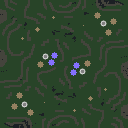](https://ashleynewson.github.io/openra-map-generator/version-20240603/?settings=eyJzZWVkIjotODg4NTE0MzQ2LCJzaXplIjoxMjgsInJvdGF0aW9ucyI6MiwibWlycm9yIjowLCJwbGF5ZXJzIjoyLCJjdXN0b21OYW1lIjoiIiwid2F2ZWxlbmd0aFNjYWxlIjowLjIsIndhdGVyIjowLCJtb3VudGFpbnMiOjAuOSwiZm9yZXN0cyI6MC4wMjUsImV4dGVybmFsQ2lyY3VsYXJCaWFzIjowLCJ0ZXJyYWluU21vb3RoaW5nIjo0LCJzbW9vdGhpbmdUaHJlc2hvbGQiOjAuMzMsIm1pbmltdW1MYW5kU2VhVGhpY2tuZXNzIjo1LCJtaW5pbXVtTW91bnRhaW5UaGlja25lc3MiOjUsIm1heGltdW1BbHRpdHVkZSI6OCwicm91Z2huZXNzUmFkaXVzIjo1LCJyb3VnaG5lc3MiOjAuNSwibWluaW11bVRlcnJhaW5Db250b3VyU3BhY2luZyI6NiwibWluaW11bUNsaWZmTGVuZ3RoIjoxMCwiZm9yZXN0Q2x1bXBpbmVzcyI6MC41LCJkZW55V2FsbGVkQXJlYXMiOnRydWUsImVuZm9yY2VTeW1tZXRyeSI6ZmFsc2UsImNyZWF0ZUVudGl0aWVzIjp0cnVlLCJzdGFydGluZ01pbmVzIjozLCJzdGFydGluZ09yZSI6MywiY2VudHJhbFJlc2VydmF0aW9uIjoxNiwic3Bhd25SZWdpb25TaXplIjoxNiwic3Bhd25CdWlsZFNpemUiOjgsInNwYXduTWluZXMiOjMsInNwYXduT3JlIjozLCJtYXhpbXVtRXhwYW5zaW9ucyI6NCwibWluaW11bUV4cGFuc2lvblNpemUiOjIsIm1heGltdW1FeHBhbnNpb25TaXplIjoxMiwiZXhwYW5zaW9uSW5uZXIiOjQsImV4cGFuc2lvbkJvcmRlciI6NCwiZXhwYW5zaW9uTWluZXMiOjAuMDIsImV4cGFuc2lvbk9yZSI6NSwiZ2VtVXBncmFkZSI6MC4xLCJtaW5pbXVtQnVpbGRpbmdzIjowLCJtYXhpbXVtQnVpbGRpbmdzIjozLCJ3ZWlnaHRGY29tIjoxLCJ3ZWlnaHRIb3NwIjoyLCJ3ZWlnaHRNaXNzIjoyLCJ3ZWlnaHRCaW8iOjAsIndlaWdodE9pbGIiOjh9) [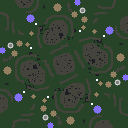](https://ashleynewson.github.io/openra-map-generator/version-20240603/?settings=eyJzZWVkIjozODUzODkwNzAsInNpemUiOjEyOCwicm90YXRpb25zIjo0LCJtaXJyb3IiOjAsInBsYXllcnMiOjEsImN1c3RvbU5hbWUiOiIiLCJ3YXZlbGVuZ3RoU2NhbGUiOjAuMiwid2F0ZXIiOjAsIm1vdW50YWlucyI6MC45LCJmb3Jlc3RzIjowLjAyNSwiZXh0ZXJuYWxDaXJjdWxhckJpYXMiOjAsInRlcnJhaW5TbW9vdGhpbmciOjQsInNtb290aGluZ1RocmVzaG9sZCI6MC4zMywibWluaW11bUxhbmRTZWFUaGlja25lc3MiOjUsIm1pbmltdW1Nb3VudGFpblRoaWNrbmVzcyI6NSwibWF4aW11bUFsdGl0dWRlIjo4LCJyb3VnaG5lc3NSYWRpdXMiOjUsInJvdWdobmVzcyI6MC41LCJtaW5pbXVtVGVycmFpbkNvbnRvdXJTcGFjaW5nIjo2LCJtaW5pbXVtQ2xpZmZMZW5ndGgiOjEwLCJmb3Jlc3RDbHVtcGluZXNzIjowLjUsImRlbnlXYWxsZWRBcmVhcyI6dHJ1ZSwiZW5mb3JjZVN5bW1ldHJ5IjpmYWxzZSwiY3JlYXRlRW50aXRpZXMiOnRydWUsInN0YXJ0aW5nTWluZXMiOjMsInN0YXJ0aW5nT3JlIjozLCJjZW50cmFsUmVzZXJ2YXRpb24iOjE2LCJzcGF3blJlZ2lvblNpemUiOjE2LCJzcGF3bkJ1aWxkU2l6ZSI6OCwic3Bhd25NaW5lcyI6Mywic3Bhd25PcmUiOjMsIm1heGltdW1FeHBhbnNpb25zIjo0LCJtaW5pbXVtRXhwYW5zaW9uU2l6ZSI6MiwibWF4aW11bUV4cGFuc2lvblNpemUiOjEyLCJleHBhbnNpb25Jbm5lciI6NCwiZXhwYW5zaW9uQm9yZGVyIjo0LCJleHBhbnNpb25NaW5lcyI6MC4wMiwiZXhwYW5zaW9uT3JlIjo1LCJnZW1VcGdyYWRlIjowLjEsIm1pbmltdW1CdWlsZGluZ3MiOjAsIm1heGltdW1CdWlsZGluZ3MiOjMsIndlaWdodEZjb20iOjEsIndlaWdodEhvc3AiOjIsIndlaWdodE1pc3MiOjIsIndlaWdodEJpbyI6MCwid2VpZ2h0T2lsYiI6OH0=)

### Continents

Large homogenous clumps of land and ocean.

[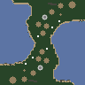](https://ashleynewson.github.io/openra-map-generator/version-20240603/?settings=eyJzZWVkIjotMTM0MzYwMzk5OSwic2l6ZSI6OTYsInJvdGF0aW9ucyI6MiwibWlycm9yIjowLCJwbGF5ZXJzIjoxLCJjdXN0b21OYW1lIjoiIiwid2F2ZWxlbmd0aFNjYWxlIjoxLCJ3YXRlciI6MC41LCJtb3VudGFpbnMiOjAuMSwiZm9yZXN0cyI6MC4wMjUsImV4dGVybmFsQ2lyY3VsYXJCaWFzIjowLCJ0ZXJyYWluU21vb3RoaW5nIjo0LCJzbW9vdGhpbmdUaHJlc2hvbGQiOjAuMzMsIm1pbmltdW1MYW5kU2VhVGhpY2tuZXNzIjo1LCJtaW5pbXVtTW91bnRhaW5UaGlja25lc3MiOjUsIm1heGltdW1BbHRpdHVkZSI6OCwicm91Z2huZXNzUmFkaXVzIjo1LCJyb3VnaG5lc3MiOjAuNSwibWluaW11bVRlcnJhaW5Db250b3VyU3BhY2luZyI6NiwibWluaW11bUNsaWZmTGVuZ3RoIjoxMCwiZm9yZXN0Q2x1bXBpbmVzcyI6MC41LCJkZW55V2FsbGVkQXJlYXMiOnRydWUsImVuZm9yY2VTeW1tZXRyeSI6ZmFsc2UsImNyZWF0ZUVudGl0aWVzIjp0cnVlLCJzdGFydGluZ01pbmVzIjozLCJzdGFydGluZ09yZSI6MywiY2VudHJhbFJlc2VydmF0aW9uIjoxNiwic3Bhd25SZWdpb25TaXplIjoxNiwic3Bhd25CdWlsZFNpemUiOjgsInNwYXduTWluZXMiOjMsInNwYXduT3JlIjozLCJtYXhpbXVtRXhwYW5zaW9ucyI6NCwibWluaW11bUV4cGFuc2lvblNpemUiOjIsIm1heGltdW1FeHBhbnNpb25TaXplIjoxMiwiZXhwYW5zaW9uSW5uZXIiOjQsImV4cGFuc2lvbkJvcmRlciI6NCwiZXhwYW5zaW9uTWluZXMiOjAuMDIsImV4cGFuc2lvbk9yZSI6NSwiZ2VtVXBncmFkZSI6MC4xLCJtaW5pbXVtQnVpbGRpbmdzIjowLCJtYXhpbXVtQnVpbGRpbmdzIjozLCJ3ZWlnaHRGY29tIjoxLCJ3ZWlnaHRIb3NwIjoyLCJ3ZWlnaHRNaXNzIjoyLCJ3ZWlnaHRCaW8iOjAsIndlaWdodE9pbGIiOjh9) [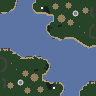](https://ashleynewson.github.io/openra-map-generator/version-20240603/?settings=eyJzZWVkIjo1ODQyMTgzOTQsInNpemUiOjk2LCJyb3RhdGlvbnMiOjIsIm1pcnJvciI6MCwicGxheWVycyI6MSwiY3VzdG9tTmFtZSI6IiIsIndhdmVsZW5ndGhTY2FsZSI6MSwid2F0ZXIiOjAuNSwibW91bnRhaW5zIjowLjEsImZvcmVzdHMiOjAuMDI1LCJleHRlcm5hbENpcmN1bGFyQmlhcyI6MCwidGVycmFpblNtb290aGluZyI6NCwic21vb3RoaW5nVGhyZXNob2xkIjowLjMzLCJtaW5pbXVtTGFuZFNlYVRoaWNrbmVzcyI6NSwibWluaW11bU1vdW50YWluVGhpY2tuZXNzIjo1LCJtYXhpbXVtQWx0aXR1ZGUiOjgsInJvdWdobmVzc1JhZGl1cyI6NSwicm91Z2huZXNzIjowLjUsIm1pbmltdW1UZXJyYWluQ29udG91clNwYWNpbmciOjYsIm1pbmltdW1DbGlmZkxlbmd0aCI6MTAsImZvcmVzdENsdW1waW5lc3MiOjAuNSwiZGVueVdhbGxlZEFyZWFzIjp0cnVlLCJlbmZvcmNlU3ltbWV0cnkiOmZhbHNlLCJjcmVhdGVFbnRpdGllcyI6dHJ1ZSwic3RhcnRpbmdNaW5lcyI6Mywic3RhcnRpbmdPcmUiOjMsImNlbnRyYWxSZXNlcnZhdGlvbiI6MTYsInNwYXduUmVnaW9uU2l6ZSI6MTYsInNwYXduQnVpbGRTaXplIjo4LCJzcGF3bk1pbmVzIjozLCJzcGF3bk9yZSI6MywibWF4aW11bUV4cGFuc2lvbnMiOjQsIm1pbmltdW1FeHBhbnNpb25TaXplIjoyLCJtYXhpbXVtRXhwYW5zaW9uU2l6ZSI6MTIsImV4cGFuc2lvbklubmVyIjo0LCJleHBhbnNpb25Cb3JkZXIiOjQsImV4cGFuc2lvbk1pbmVzIjowLjAyLCJleHBhbnNpb25PcmUiOjUsImdlbVVwZ3JhZGUiOjAuMSwibWluaW11bUJ1aWxkaW5ncyI6MCwibWF4aW11bUJ1aWxkaW5ncyI6Mywid2VpZ2h0RmNvbSI6MSwid2VpZ2h0SG9zcCI6Miwid2VpZ2h0TWlzcyI6Miwid2VpZ2h0QmlvIjowLCJ3ZWlnaHRPaWxiIjo4fQ==) [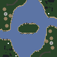](https://ashleynewson.github.io/openra-map-generator/version-20240603/?settings=eyJzZWVkIjotNDY3MDgyOTE5LCJzaXplIjo5Niwicm90YXRpb25zIjoyLCJtaXJyb3IiOjAsInBsYXllcnMiOjEsImN1c3RvbU5hbWUiOiIiLCJ3YXZlbGVuZ3RoU2NhbGUiOjEsIndhdGVyIjowLjUsIm1vdW50YWlucyI6MC4xLCJmb3Jlc3RzIjowLjAyNSwiZXh0ZXJuYWxDaXJjdWxhckJpYXMiOjAsInRlcnJhaW5TbW9vdGhpbmciOjQsInNtb290aGluZ1RocmVzaG9sZCI6MC4zMywibWluaW11bUxhbmRTZWFUaGlja25lc3MiOjUsIm1pbmltdW1Nb3VudGFpblRoaWNrbmVzcyI6NSwibWF4aW11bUFsdGl0dWRlIjo4LCJyb3VnaG5lc3NSYWRpdXMiOjUsInJvdWdobmVzcyI6MC41LCJtaW5pbXVtVGVycmFpbkNvbnRvdXJTcGFjaW5nIjo2LCJtaW5pbXVtQ2xpZmZMZW5ndGgiOjEwLCJmb3Jlc3RDbHVtcGluZXNzIjowLjUsImRlbnlXYWxsZWRBcmVhcyI6dHJ1ZSwiZW5mb3JjZVN5bW1ldHJ5IjpmYWxzZSwiY3JlYXRlRW50aXRpZXMiOnRydWUsInN0YXJ0aW5nTWluZXMiOjMsInN0YXJ0aW5nT3JlIjozLCJjZW50cmFsUmVzZXJ2YXRpb24iOjE2LCJzcGF3blJlZ2lvblNpemUiOjE2LCJzcGF3bkJ1aWxkU2l6ZSI6OCwic3Bhd25NaW5lcyI6Mywic3Bhd25PcmUiOjMsIm1heGltdW1FeHBhbnNpb25zIjo0LCJtaW5pbXVtRXhwYW5zaW9uU2l6ZSI6MiwibWF4aW11bUV4cGFuc2lvblNpemUiOjEyLCJleHBhbnNpb25Jbm5lciI6NCwiZXhwYW5zaW9uQm9yZGVyIjo0LCJleHBhbnNpb25NaW5lcyI6MC4wMiwiZXhwYW5zaW9uT3JlIjo1LCJnZW1VcGdyYWRlIjowLjEsIm1pbmltdW1CdWlsZGluZ3MiOjAsIm1heGltdW1CdWlsZGluZ3MiOjMsIndlaWdodEZjb20iOjEsIndlaWdodEhvc3AiOjIsIndlaWdodE1pc3MiOjIsIndlaWdodEJpbyI6MCwid2VpZ2h0T2lsYiI6OH0=)

[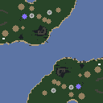](https://ashleynewson.github.io/openra-map-generator/version-20240603/?settings=eyJzZWVkIjotNDYxOTA0MzgwLCJzaXplIjoxMjgsInJvdGF0aW9ucyI6MiwibWlycm9yIjowLCJwbGF5ZXJzIjoyLCJjdXN0b21OYW1lIjoiIiwid2F2ZWxlbmd0aFNjYWxlIjoxLCJ3YXRlciI6MC41LCJtb3VudGFpbnMiOjAuMSwiZm9yZXN0cyI6MC4wMjUsImV4dGVybmFsQ2lyY3VsYXJCaWFzIjowLCJ0ZXJyYWluU21vb3RoaW5nIjo0LCJzbW9vdGhpbmdUaHJlc2hvbGQiOjAuMzMsIm1pbmltdW1MYW5kU2VhVGhpY2tuZXNzIjo1LCJtaW5pbXVtTW91bnRhaW5UaGlja25lc3MiOjUsIm1heGltdW1BbHRpdHVkZSI6OCwicm91Z2huZXNzUmFkaXVzIjo1LCJyb3VnaG5lc3MiOjAuNSwibWluaW11bVRlcnJhaW5Db250b3VyU3BhY2luZyI6NiwibWluaW11bUNsaWZmTGVuZ3RoIjoxMCwiZm9yZXN0Q2x1bXBpbmVzcyI6MC41LCJkZW55V2FsbGVkQXJlYXMiOnRydWUsImVuZm9yY2VTeW1tZXRyeSI6ZmFsc2UsImNyZWF0ZUVudGl0aWVzIjp0cnVlLCJzdGFydGluZ01pbmVzIjozLCJzdGFydGluZ09yZSI6MywiY2VudHJhbFJlc2VydmF0aW9uIjoxNiwic3Bhd25SZWdpb25TaXplIjoxNiwic3Bhd25CdWlsZFNpemUiOjgsInNwYXduTWluZXMiOjMsInNwYXduT3JlIjozLCJtYXhpbXVtRXhwYW5zaW9ucyI6NCwibWluaW11bUV4cGFuc2lvblNpemUiOjIsIm1heGltdW1FeHBhbnNpb25TaXplIjoxMiwiZXhwYW5zaW9uSW5uZXIiOjQsImV4cGFuc2lvbkJvcmRlciI6NCwiZXhwYW5zaW9uTWluZXMiOjAuMDIsImV4cGFuc2lvbk9yZSI6NSwiZ2VtVXBncmFkZSI6MC4xLCJtaW5pbXVtQnVpbGRpbmdzIjowLCJtYXhpbXVtQnVpbGRpbmdzIjozLCJ3ZWlnaHRGY29tIjoxLCJ3ZWlnaHRIb3NwIjoyLCJ3ZWlnaHRNaXNzIjoyLCJ3ZWlnaHRCaW8iOjAsIndlaWdodE9pbGIiOjh9) [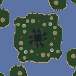](https://ashleynewson.github.io/openra-map-generator/version-20240603/?settings=eyJzZWVkIjoxMTI2MjIwNDE4LCJzaXplIjoxMjgsInJvdGF0aW9ucyI6NCwibWlycm9yIjowLCJwbGF5ZXJzIjoxLCJjdXN0b21OYW1lIjoiIiwid2F2ZWxlbmd0aFNjYWxlIjoxLCJ3YXRlciI6MC41LCJtb3VudGFpbnMiOjAuMSwiZm9yZXN0cyI6MC4wMjUsImV4dGVybmFsQ2lyY3VsYXJCaWFzIjowLCJ0ZXJyYWluU21vb3RoaW5nIjo0LCJzbW9vdGhpbmdUaHJlc2hvbGQiOjAuMzMsIm1pbmltdW1MYW5kU2VhVGhpY2tuZXNzIjo1LCJtaW5pbXVtTW91bnRhaW5UaGlja25lc3MiOjUsIm1heGltdW1BbHRpdHVkZSI6OCwicm91Z2huZXNzUmFkaXVzIjo1LCJyb3VnaG5lc3MiOjAuNSwibWluaW11bVRlcnJhaW5Db250b3VyU3BhY2luZyI6NiwibWluaW11bUNsaWZmTGVuZ3RoIjoxMCwiZm9yZXN0Q2x1bXBpbmVzcyI6MC41LCJkZW55V2FsbGVkQXJlYXMiOnRydWUsImVuZm9yY2VTeW1tZXRyeSI6ZmFsc2UsImNyZWF0ZUVudGl0aWVzIjp0cnVlLCJzdGFydGluZ01pbmVzIjozLCJzdGFydGluZ09yZSI6MywiY2VudHJhbFJlc2VydmF0aW9uIjoxNiwic3Bhd25SZWdpb25TaXplIjoxNiwic3Bhd25CdWlsZFNpemUiOjgsInNwYXduTWluZXMiOjMsInNwYXduT3JlIjozLCJtYXhpbXVtRXhwYW5zaW9ucyI6NCwibWluaW11bUV4cGFuc2lvblNpemUiOjIsIm1heGltdW1FeHBhbnNpb25TaXplIjoxMiwiZXhwYW5zaW9uSW5uZXIiOjQsImV4cGFuc2lvbkJvcmRlciI6NCwiZXhwYW5zaW9uTWluZXMiOjAuMDIsImV4cGFuc2lvbk9yZSI6NSwiZ2VtVXBncmFkZSI6MC4xLCJtaW5pbXVtQnVpbGRpbmdzIjowLCJtYXhpbXVtQnVpbGRpbmdzIjozLCJ3ZWlnaHRGY29tIjoxLCJ3ZWlnaHRIb3NwIjoyLCJ3ZWlnaHRNaXNzIjoyLCJ3ZWlnaHRCaW8iOjAsIndlaWdodE9pbGIiOjh9)

### Wetlands

Narrow strips of land and water.

[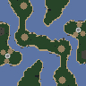](https://ashleynewson.github.io/openra-map-generator/version-20240603/?settings=eyJzZWVkIjoyMDcyMzYzMDgyLCJzaXplIjo5Niwicm90YXRpb25zIjoyLCJtaXJyb3IiOjAsInBsYXllcnMiOjEsImN1c3RvbU5hbWUiOiIiLCJ3YXZlbGVuZ3RoU2NhbGUiOjAuMiwid2F0ZXIiOjAuNSwibW91bnRhaW5zIjowLjEsImZvcmVzdHMiOjAuMDI1LCJleHRlcm5hbENpcmN1bGFyQmlhcyI6MCwidGVycmFpblNtb290aGluZyI6NCwic21vb3RoaW5nVGhyZXNob2xkIjowLjMzLCJtaW5pbXVtTGFuZFNlYVRoaWNrbmVzcyI6NSwibWluaW11bU1vdW50YWluVGhpY2tuZXNzIjo1LCJtYXhpbXVtQWx0aXR1ZGUiOjgsInJvdWdobmVzc1JhZGl1cyI6NSwicm91Z2huZXNzIjowLjUsIm1pbmltdW1UZXJyYWluQ29udG91clNwYWNpbmciOjYsIm1pbmltdW1DbGlmZkxlbmd0aCI6MTAsImZvcmVzdENsdW1waW5lc3MiOjAuNSwiZGVueVdhbGxlZEFyZWFzIjp0cnVlLCJlbmZvcmNlU3ltbWV0cnkiOmZhbHNlLCJjcmVhdGVFbnRpdGllcyI6dHJ1ZSwic3RhcnRpbmdNaW5lcyI6Mywic3RhcnRpbmdPcmUiOjMsImNlbnRyYWxSZXNlcnZhdGlvbiI6MTYsInNwYXduUmVnaW9uU2l6ZSI6MTYsInNwYXduQnVpbGRTaXplIjo4LCJzcGF3bk1pbmVzIjozLCJzcGF3bk9yZSI6MywibWF4aW11bUV4cGFuc2lvbnMiOjQsIm1pbmltdW1FeHBhbnNpb25TaXplIjoyLCJtYXhpbXVtRXhwYW5zaW9uU2l6ZSI6MTIsImV4cGFuc2lvbklubmVyIjo0LCJleHBhbnNpb25Cb3JkZXIiOjQsImV4cGFuc2lvbk1pbmVzIjowLjAyLCJleHBhbnNpb25PcmUiOjUsImdlbVVwZ3JhZGUiOjAuMSwibWluaW11bUJ1aWxkaW5ncyI6MCwibWF4aW11bUJ1aWxkaW5ncyI6Mywid2VpZ2h0RmNvbSI6MSwid2VpZ2h0SG9zcCI6Miwid2VpZ2h0TWlzcyI6Miwid2VpZ2h0QmlvIjowLCJ3ZWlnaHRPaWxiIjo4fQ==) [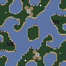](https://ashleynewson.github.io/openra-map-generator/version-20240603/?settings=eyJzZWVkIjoyMTAyOTE5MTA5LCJzaXplIjo5Niwicm90YXRpb25zIjoyLCJtaXJyb3IiOjAsInBsYXllcnMiOjEsImN1c3RvbU5hbWUiOiIiLCJ3YXZlbGVuZ3RoU2NhbGUiOjAuMiwid2F0ZXIiOjAuNSwibW91bnRhaW5zIjowLjEsImZvcmVzdHMiOjAuMDI1LCJleHRlcm5hbENpcmN1bGFyQmlhcyI6MCwidGVycmFpblNtb290aGluZyI6NCwic21vb3RoaW5nVGhyZXNob2xkIjowLjMzLCJtaW5pbXVtTGFuZFNlYVRoaWNrbmVzcyI6NSwibWluaW11bU1vdW50YWluVGhpY2tuZXNzIjo1LCJtYXhpbXVtQWx0aXR1ZGUiOjgsInJvdWdobmVzc1JhZGl1cyI6NSwicm91Z2huZXNzIjowLjUsIm1pbmltdW1UZXJyYWluQ29udG91clNwYWNpbmciOjYsIm1pbmltdW1DbGlmZkxlbmd0aCI6MTAsImZvcmVzdENsdW1waW5lc3MiOjAuNSwiZGVueVdhbGxlZEFyZWFzIjp0cnVlLCJlbmZvcmNlU3ltbWV0cnkiOmZhbHNlLCJjcmVhdGVFbnRpdGllcyI6dHJ1ZSwic3RhcnRpbmdNaW5lcyI6Mywic3RhcnRpbmdPcmUiOjMsImNlbnRyYWxSZXNlcnZhdGlvbiI6MTYsInNwYXduUmVnaW9uU2l6ZSI6MTYsInNwYXduQnVpbGRTaXplIjo4LCJzcGF3bk1pbmVzIjozLCJzcGF3bk9yZSI6MywibWF4aW11bUV4cGFuc2lvbnMiOjQsIm1pbmltdW1FeHBhbnNpb25TaXplIjoyLCJtYXhpbXVtRXhwYW5zaW9uU2l6ZSI6MTIsImV4cGFuc2lvbklubmVyIjo0LCJleHBhbnNpb25Cb3JkZXIiOjQsImV4cGFuc2lvbk1pbmVzIjowLjAyLCJleHBhbnNpb25PcmUiOjUsImdlbVVwZ3JhZGUiOjAuMSwibWluaW11bUJ1aWxkaW5ncyI6MCwibWF4aW11bUJ1aWxkaW5ncyI6Mywid2VpZ2h0RmNvbSI6MSwid2VpZ2h0SG9zcCI6Miwid2VpZ2h0TWlzcyI6Miwid2VpZ2h0QmlvIjowLCJ3ZWlnaHRPaWxiIjo4fQ==) [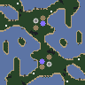](https://ashleynewson.github.io/openra-map-generator/version-20240603/?settings=eyJzZWVkIjotMjAzNzQ4NDQ0Mywic2l6ZSI6OTYsInJvdGF0aW9ucyI6MiwibWlycm9yIjowLCJwbGF5ZXJzIjoxLCJjdXN0b21OYW1lIjoiIiwid2F2ZWxlbmd0aFNjYWxlIjowLjIsIndhdGVyIjowLjUsIm1vdW50YWlucyI6MC4xLCJmb3Jlc3RzIjowLjAyNSwiZXh0ZXJuYWxDaXJjdWxhckJpYXMiOjAsInRlcnJhaW5TbW9vdGhpbmciOjQsInNtb290aGluZ1RocmVzaG9sZCI6MC4zMywibWluaW11bUxhbmRTZWFUaGlja25lc3MiOjUsIm1pbmltdW1Nb3VudGFpblRoaWNrbmVzcyI6NSwibWF4aW11bUFsdGl0dWRlIjo4LCJyb3VnaG5lc3NSYWRpdXMiOjUsInJvdWdobmVzcyI6MC41LCJtaW5pbXVtVGVycmFpbkNvbnRvdXJTcGFjaW5nIjo2LCJtaW5pbXVtQ2xpZmZMZW5ndGgiOjEwLCJmb3Jlc3RDbHVtcGluZXNzIjowLjUsImRlbnlXYWxsZWRBcmVhcyI6dHJ1ZSwiZW5mb3JjZVN5bW1ldHJ5IjpmYWxzZSwiY3JlYXRlRW50aXRpZXMiOnRydWUsInN0YXJ0aW5nTWluZXMiOjMsInN0YXJ0aW5nT3JlIjozLCJjZW50cmFsUmVzZXJ2YXRpb24iOjE2LCJzcGF3blJlZ2lvblNpemUiOjE2LCJzcGF3bkJ1aWxkU2l6ZSI6OCwic3Bhd25NaW5lcyI6Mywic3Bhd25PcmUiOjMsIm1heGltdW1FeHBhbnNpb25zIjo0LCJtaW5pbXVtRXhwYW5zaW9uU2l6ZSI6MiwibWF4aW11bUV4cGFuc2lvblNpemUiOjEyLCJleHBhbnNpb25Jbm5lciI6NCwiZXhwYW5zaW9uQm9yZGVyIjo0LCJleHBhbnNpb25NaW5lcyI6MC4wMiwiZXhwYW5zaW9uT3JlIjo1LCJnZW1VcGdyYWRlIjowLjEsIm1pbmltdW1CdWlsZGluZ3MiOjAsIm1heGltdW1CdWlsZGluZ3MiOjMsIndlaWdodEZjb20iOjEsIndlaWdodEhvc3AiOjIsIndlaWdodE1pc3MiOjIsIndlaWdodEJpbyI6MCwid2VpZ2h0T2lsYiI6OH0=)

[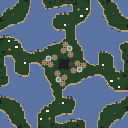](https://ashleynewson.github.io/openra-map-generator/version-20240603/?settings=eyJzZWVkIjo2Mjg5NTEyMDQsInNpemUiOjEyOCwicm90YXRpb25zIjo0LCJtaXJyb3IiOjAsInBsYXllcnMiOjEsImN1c3RvbU5hbWUiOiIiLCJ3YXZlbGVuZ3RoU2NhbGUiOjAuMiwid2F0ZXIiOjAuNSwibW91bnRhaW5zIjowLjEsImZvcmVzdHMiOjAuMDI1LCJleHRlcm5hbENpcmN1bGFyQmlhcyI6MCwidGVycmFpblNtb290aGluZyI6NCwic21vb3RoaW5nVGhyZXNob2xkIjowLjMzLCJtaW5pbXVtTGFuZFNlYVRoaWNrbmVzcyI6NSwibWluaW11bU1vdW50YWluVGhpY2tuZXNzIjo1LCJtYXhpbXVtQWx0aXR1ZGUiOjgsInJvdWdobmVzc1JhZGl1cyI6NSwicm91Z2huZXNzIjowLjUsIm1pbmltdW1UZXJyYWluQ29udG91clNwYWNpbmciOjYsIm1pbmltdW1DbGlmZkxlbmd0aCI6MTAsImZvcmVzdENsdW1waW5lc3MiOjAuNSwiZGVueVdhbGxlZEFyZWFzIjp0cnVlLCJlbmZvcmNlU3ltbWV0cnkiOmZhbHNlLCJjcmVhdGVFbnRpdGllcyI6dHJ1ZSwic3RhcnRpbmdNaW5lcyI6Mywic3RhcnRpbmdPcmUiOjMsImNlbnRyYWxSZXNlcnZhdGlvbiI6MTYsInNwYXduUmVnaW9uU2l6ZSI6MTYsInNwYXduQnVpbGRTaXplIjo4LCJzcGF3bk1pbmVzIjozLCJzcGF3bk9yZSI6MywibWF4aW11bUV4cGFuc2lvbnMiOjQsIm1pbmltdW1FeHBhbnNpb25TaXplIjoyLCJtYXhpbXVtRXhwYW5zaW9uU2l6ZSI6MTIsImV4cGFuc2lvbklubmVyIjo0LCJleHBhbnNpb25Cb3JkZXIiOjQsImV4cGFuc2lvbk1pbmVzIjowLjAyLCJleHBhbnNpb25PcmUiOjUsImdlbVVwZ3JhZGUiOjAuMSwibWluaW11bUJ1aWxkaW5ncyI6MCwibWF4aW11bUJ1aWxkaW5ncyI6Mywid2VpZ2h0RmNvbSI6MSwid2VpZ2h0SG9zcCI6Miwid2VpZ2h0TWlzcyI6Miwid2VpZ2h0QmlvIjowLCJ3ZWlnaHRPaWxiIjo4fQ==) [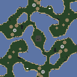](https://ashleynewson.github.io/openra-map-generator/version-20240603/?settings=eyJzZWVkIjotMTIyMTI4MjQ4NCwic2l6ZSI6MTI4LCJyb3RhdGlvbnMiOjIsIm1pcnJvciI6MCwicGxheWVycyI6MiwiY3VzdG9tTmFtZSI6IiIsIndhdmVsZW5ndGhTY2FsZSI6MC4yLCJ3YXRlciI6MC41LCJtb3VudGFpbnMiOjAuMSwiZm9yZXN0cyI6MC4wMjUsImV4dGVybmFsQ2lyY3VsYXJCaWFzIjowLCJ0ZXJyYWluU21vb3RoaW5nIjo0LCJzbW9vdGhpbmdUaHJlc2hvbGQiOjAuMzMsIm1pbmltdW1MYW5kU2VhVGhpY2tuZXNzIjo1LCJtaW5pbXVtTW91bnRhaW5UaGlja25lc3MiOjUsIm1heGltdW1BbHRpdHVkZSI6OCwicm91Z2huZXNzUmFkaXVzIjo1LCJyb3VnaG5lc3MiOjAuNSwibWluaW11bVRlcnJhaW5Db250b3VyU3BhY2luZyI6NiwibWluaW11bUNsaWZmTGVuZ3RoIjoxMCwiZm9yZXN0Q2x1bXBpbmVzcyI6MC41LCJkZW55V2FsbGVkQXJlYXMiOnRydWUsImVuZm9yY2VTeW1tZXRyeSI6ZmFsc2UsImNyZWF0ZUVudGl0aWVzIjp0cnVlLCJzdGFydGluZ01pbmVzIjozLCJzdGFydGluZ09yZSI6MywiY2VudHJhbFJlc2VydmF0aW9uIjoxNiwic3Bhd25SZWdpb25TaXplIjoxNiwic3Bhd25CdWlsZFNpemUiOjgsInNwYXduTWluZXMiOjMsInNwYXduT3JlIjozLCJtYXhpbXVtRXhwYW5zaW9ucyI6NCwibWluaW11bUV4cGFuc2lvblNpemUiOjIsIm1heGltdW1FeHBhbnNpb25TaXplIjoxMiwiZXhwYW5zaW9uSW5uZXIiOjQsImV4cGFuc2lvbkJvcmRlciI6NCwiZXhwYW5zaW9uTWluZXMiOjAuMDIsImV4cGFuc2lvbk9yZSI6NSwiZ2VtVXBncmFkZSI6MC4xLCJtaW5pbXVtQnVpbGRpbmdzIjowLCJtYXhpbXVtQnVpbGRpbmdzIjozLCJ3ZWlnaHRGY29tIjoxLCJ3ZWlnaHRIb3NwIjoyLCJ3ZWlnaHRNaXNzIjoyLCJ3ZWlnaHRCaW8iOjAsIndlaWdodE9pbGIiOjh9)

### Puddles

Small bodies of water, some trees, and a few rocks.

[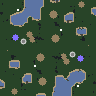](https://ashleynewson.github.io/openra-map-generator/version-20240603/?settings=eyJzZWVkIjo0Mzg5NjQ1NDcsInNpemUiOjk2LCJyb3RhdGlvbnMiOjIsIm1pcnJvciI6MCwicGxheWVycyI6MSwiY3VzdG9tTmFtZSI6IiIsIndhdmVsZW5ndGhTY2FsZSI6MC4yLCJ3YXRlciI6MC4yLCJtb3VudGFpbnMiOjAuMSwiZm9yZXN0cyI6MC4wMjUsImV4dGVybmFsQ2lyY3VsYXJCaWFzIjowLCJ0ZXJyYWluU21vb3RoaW5nIjo0LCJzbW9vdGhpbmdUaHJlc2hvbGQiOjAuMzMsIm1pbmltdW1MYW5kU2VhVGhpY2tuZXNzIjo1LCJtaW5pbXVtTW91bnRhaW5UaGlja25lc3MiOjUsIm1heGltdW1BbHRpdHVkZSI6OCwicm91Z2huZXNzUmFkaXVzIjo1LCJyb3VnaG5lc3MiOjAuNSwibWluaW11bVRlcnJhaW5Db250b3VyU3BhY2luZyI6NiwibWluaW11bUNsaWZmTGVuZ3RoIjoxMCwiZm9yZXN0Q2x1bXBpbmVzcyI6MC41LCJkZW55V2FsbGVkQXJlYXMiOnRydWUsImVuZm9yY2VTeW1tZXRyeSI6ZmFsc2UsImNyZWF0ZUVudGl0aWVzIjp0cnVlLCJzdGFydGluZ01pbmVzIjozLCJzdGFydGluZ09yZSI6MywiY2VudHJhbFJlc2VydmF0aW9uIjoxNiwic3Bhd25SZWdpb25TaXplIjoxNiwic3Bhd25CdWlsZFNpemUiOjgsInNwYXduTWluZXMiOjMsInNwYXduT3JlIjozLCJtYXhpbXVtRXhwYW5zaW9ucyI6NCwibWluaW11bUV4cGFuc2lvblNpemUiOjIsIm1heGltdW1FeHBhbnNpb25TaXplIjoxMiwiZXhwYW5zaW9uSW5uZXIiOjQsImV4cGFuc2lvbkJvcmRlciI6NCwiZXhwYW5zaW9uTWluZXMiOjAuMDIsImV4cGFuc2lvbk9yZSI6NSwiZ2VtVXBncmFkZSI6MC4xLCJtaW5pbXVtQnVpbGRpbmdzIjowLCJtYXhpbXVtQnVpbGRpbmdzIjozLCJ3ZWlnaHRGY29tIjoxLCJ3ZWlnaHRIb3NwIjoyLCJ3ZWlnaHRNaXNzIjoyLCJ3ZWlnaHRCaW8iOjAsIndlaWdodE9pbGIiOjh9) [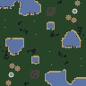](https://ashleynewson.github.io/openra-map-generator/version-20240603/?settings=eyJzZWVkIjotMTcyOTczODIzMiwic2l6ZSI6OTYsInJvdGF0aW9ucyI6MiwibWlycm9yIjowLCJwbGF5ZXJzIjoxLCJjdXN0b21OYW1lIjoiIiwid2F2ZWxlbmd0aFNjYWxlIjowLjIsIndhdGVyIjowLjIsIm1vdW50YWlucyI6MC4xLCJmb3Jlc3RzIjowLjAyNSwiZXh0ZXJuYWxDaXJjdWxhckJpYXMiOjAsInRlcnJhaW5TbW9vdGhpbmciOjQsInNtb290aGluZ1RocmVzaG9sZCI6MC4zMywibWluaW11bUxhbmRTZWFUaGlja25lc3MiOjUsIm1pbmltdW1Nb3VudGFpblRoaWNrbmVzcyI6NSwibWF4aW11bUFsdGl0dWRlIjo4LCJyb3VnaG5lc3NSYWRpdXMiOjUsInJvdWdobmVzcyI6MC41LCJtaW5pbXVtVGVycmFpbkNvbnRvdXJTcGFjaW5nIjo2LCJtaW5pbXVtQ2xpZmZMZW5ndGgiOjEwLCJmb3Jlc3RDbHVtcGluZXNzIjowLjUsImRlbnlXYWxsZWRBcmVhcyI6dHJ1ZSwiZW5mb3JjZVN5bW1ldHJ5IjpmYWxzZSwiY3JlYXRlRW50aXRpZXMiOnRydWUsInN0YXJ0aW5nTWluZXMiOjMsInN0YXJ0aW5nT3JlIjozLCJjZW50cmFsUmVzZXJ2YXRpb24iOjE2LCJzcGF3blJlZ2lvblNpemUiOjE2LCJzcGF3bkJ1aWxkU2l6ZSI6OCwic3Bhd25NaW5lcyI6Mywic3Bhd25PcmUiOjMsIm1heGltdW1FeHBhbnNpb25zIjo0LCJtaW5pbXVtRXhwYW5zaW9uU2l6ZSI6MiwibWF4aW11bUV4cGFuc2lvblNpemUiOjEyLCJleHBhbnNpb25Jbm5lciI6NCwiZXhwYW5zaW9uQm9yZGVyIjo0LCJleHBhbnNpb25NaW5lcyI6MC4wMiwiZXhwYW5zaW9uT3JlIjo1LCJnZW1VcGdyYWRlIjowLjEsIm1pbmltdW1CdWlsZGluZ3MiOjAsIm1heGltdW1CdWlsZGluZ3MiOjMsIndlaWdodEZjb20iOjEsIndlaWdodEhvc3AiOjIsIndlaWdodE1pc3MiOjIsIndlaWdodEJpbyI6MCwid2VpZ2h0T2lsYiI6OH0=) [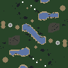](https://ashleynewson.github.io/openra-map-generator/version-20240603/?settings=eyJzZWVkIjo4NDM0NjkxNTMsInNpemUiOjk2LCJyb3RhdGlvbnMiOjIsIm1pcnJvciI6MCwicGxheWVycyI6MSwiY3VzdG9tTmFtZSI6IiIsIndhdmVsZW5ndGhTY2FsZSI6MC4yLCJ3YXRlciI6MC4yLCJtb3VudGFpbnMiOjAuMSwiZm9yZXN0cyI6MC4wMjUsImV4dGVybmFsQ2lyY3VsYXJCaWFzIjowLCJ0ZXJyYWluU21vb3RoaW5nIjo0LCJzbW9vdGhpbmdUaHJlc2hvbGQiOjAuMzMsIm1pbmltdW1MYW5kU2VhVGhpY2tuZXNzIjo1LCJtaW5pbXVtTW91bnRhaW5UaGlja25lc3MiOjUsIm1heGltdW1BbHRpdHVkZSI6OCwicm91Z2huZXNzUmFkaXVzIjo1LCJyb3VnaG5lc3MiOjAuNSwibWluaW11bVRlcnJhaW5Db250b3VyU3BhY2luZyI6NiwibWluaW11bUNsaWZmTGVuZ3RoIjoxMCwiZm9yZXN0Q2x1bXBpbmVzcyI6MC41LCJkZW55V2FsbGVkQXJlYXMiOnRydWUsImVuZm9yY2VTeW1tZXRyeSI6ZmFsc2UsImNyZWF0ZUVudGl0aWVzIjp0cnVlLCJzdGFydGluZ01pbmVzIjozLCJzdGFydGluZ09yZSI6MywiY2VudHJhbFJlc2VydmF0aW9uIjoxNiwic3Bhd25SZWdpb25TaXplIjoxNiwic3Bhd25CdWlsZFNpemUiOjgsInNwYXduTWluZXMiOjMsInNwYXduT3JlIjozLCJtYXhpbXVtRXhwYW5zaW9ucyI6NCwibWluaW11bUV4cGFuc2lvblNpemUiOjIsIm1heGltdW1FeHBhbnNpb25TaXplIjoxMiwiZXhwYW5zaW9uSW5uZXIiOjQsImV4cGFuc2lvbkJvcmRlciI6NCwiZXhwYW5zaW9uTWluZXMiOjAuMDIsImV4cGFuc2lvbk9yZSI6NSwiZ2VtVXBncmFkZSI6MC4xLCJtaW5pbXVtQnVpbGRpbmdzIjowLCJtYXhpbXVtQnVpbGRpbmdzIjozLCJ3ZWlnaHRGY29tIjoxLCJ3ZWlnaHRIb3NwIjoyLCJ3ZWlnaHRNaXNzIjoyLCJ3ZWlnaHRCaW8iOjAsIndlaWdodE9pbGIiOjh9)

[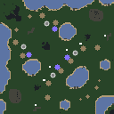](https://ashleynewson.github.io/openra-map-generator/version-20240603/?settings=eyJzZWVkIjoxMjAwMDM2MzM5LCJzaXplIjoxMjgsInJvdGF0aW9ucyI6MSwibWlycm9yIjoyLCJwbGF5ZXJzIjoyLCJjdXN0b21OYW1lIjoiIiwid2F2ZWxlbmd0aFNjYWxlIjowLjIsIndhdGVyIjowLjIsIm1vdW50YWlucyI6MC4xLCJmb3Jlc3RzIjowLjAyNSwiZXh0ZXJuYWxDaXJjdWxhckJpYXMiOjAsInRlcnJhaW5TbW9vdGhpbmciOjQsInNtb290aGluZ1RocmVzaG9sZCI6MC4zMywibWluaW11bUxhbmRTZWFUaGlja25lc3MiOjUsIm1pbmltdW1Nb3VudGFpblRoaWNrbmVzcyI6NSwibWF4aW11bUFsdGl0dWRlIjo4LCJyb3VnaG5lc3NSYWRpdXMiOjUsInJvdWdobmVzcyI6MC41LCJtaW5pbXVtVGVycmFpbkNvbnRvdXJTcGFjaW5nIjo2LCJtaW5pbXVtQ2xpZmZMZW5ndGgiOjEwLCJmb3Jlc3RDbHVtcGluZXNzIjowLjUsImRlbnlXYWxsZWRBcmVhcyI6dHJ1ZSwiZW5mb3JjZVN5bW1ldHJ5IjpmYWxzZSwiY3JlYXRlRW50aXRpZXMiOnRydWUsInN0YXJ0aW5nTWluZXMiOjMsInN0YXJ0aW5nT3JlIjozLCJjZW50cmFsUmVzZXJ2YXRpb24iOjE2LCJzcGF3blJlZ2lvblNpemUiOjE2LCJzcGF3bkJ1aWxkU2l6ZSI6OCwic3Bhd25NaW5lcyI6Mywic3Bhd25PcmUiOjMsIm1heGltdW1FeHBhbnNpb25zIjo0LCJtaW5pbXVtRXhwYW5zaW9uU2l6ZSI6MiwibWF4aW11bUV4cGFuc2lvblNpemUiOjEyLCJleHBhbnNpb25Jbm5lciI6NCwiZXhwYW5zaW9uQm9yZGVyIjo0LCJleHBhbnNpb25NaW5lcyI6MC4wMiwiZXhwYW5zaW9uT3JlIjo1LCJnZW1VcGdyYWRlIjowLjEsIm1pbmltdW1CdWlsZGluZ3MiOjAsIm1heGltdW1CdWlsZGluZ3MiOjMsIndlaWdodEZjb20iOjEsIndlaWdodEhvc3AiOjIsIndlaWdodE1pc3MiOjIsIndlaWdodEJpbyI6MCwid2VpZ2h0T2lsYiI6OH0=) [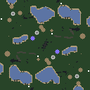](https://ashleynewson.github.io/openra-map-generator/version-20240603/?settings=eyJzZWVkIjoxNTQyODEyMDM4LCJzaXplIjoxMjgsInJvdGF0aW9ucyI6MiwibWlycm9yIjowLCJwbGF5ZXJzIjoyLCJjdXN0b21OYW1lIjoiIiwid2F2ZWxlbmd0aFNjYWxlIjowLjIsIndhdGVyIjowLjIsIm1vdW50YWlucyI6MC4xLCJmb3Jlc3RzIjowLjAyNSwiZXh0ZXJuYWxDaXJjdWxhckJpYXMiOjAsInRlcnJhaW5TbW9vdGhpbmciOjQsInNtb290aGluZ1RocmVzaG9sZCI6MC4zMywibWluaW11bUxhbmRTZWFUaGlja25lc3MiOjUsIm1pbmltdW1Nb3VudGFpblRoaWNrbmVzcyI6NSwibWF4aW11bUFsdGl0dWRlIjo4LCJyb3VnaG5lc3NSYWRpdXMiOjUsInJvdWdobmVzcyI6MC41LCJtaW5pbXVtVGVycmFpbkNvbnRvdXJTcGFjaW5nIjo2LCJtaW5pbXVtQ2xpZmZMZW5ndGgiOjEwLCJmb3Jlc3RDbHVtcGluZXNzIjowLjUsImRlbnlXYWxsZWRBcmVhcyI6dHJ1ZSwiZW5mb3JjZVN5bW1ldHJ5IjpmYWxzZSwiY3JlYXRlRW50aXRpZXMiOnRydWUsInN0YXJ0aW5nTWluZXMiOjMsInN0YXJ0aW5nT3JlIjozLCJjZW50cmFsUmVzZXJ2YXRpb24iOjE2LCJzcGF3blJlZ2lvblNpemUiOjE2LCJzcGF3bkJ1aWxkU2l6ZSI6OCwic3Bhd25NaW5lcyI6Mywic3Bhd25PcmUiOjMsIm1heGltdW1FeHBhbnNpb25zIjo0LCJtaW5pbXVtRXhwYW5zaW9uU2l6ZSI6MiwibWF4aW11bUV4cGFuc2lvblNpemUiOjEyLCJleHBhbnNpb25Jbm5lciI6NCwiZXhwYW5zaW9uQm9yZGVyIjo0LCJleHBhbnNpb25NaW5lcyI6MC4wMiwiZXhwYW5zaW9uT3JlIjo1LCJnZW1VcGdyYWRlIjowLjEsIm1pbmltdW1CdWlsZGluZ3MiOjAsIm1heGltdW1CdWlsZGluZ3MiOjMsIndlaWdodEZjb20iOjEsIndlaWdodEhvc3AiOjIsIndlaWdodE1pc3MiOjIsIndlaWdodEJpbyI6MCwid2VpZ2h0T2lsYiI6OH0=)

### Oceanic

Space is a limited resource on these scattered islands.

[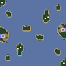](https://ashleynewson.github.io/openra-map-generator/version-20240603/?settings=eyJzZWVkIjo5MjU3MDM0NDksInNpemUiOjk2LCJyb3RhdGlvbnMiOjIsIm1pcnJvciI6MCwicGxheWVycyI6MSwiY3VzdG9tTmFtZSI6IiIsIndhdmVsZW5ndGhTY2FsZSI6MC4yLCJ3YXRlciI6MC44LCJtb3VudGFpbnMiOjAuMSwiZm9yZXN0cyI6MCwiZXh0ZXJuYWxDaXJjdWxhckJpYXMiOjAsInRlcnJhaW5TbW9vdGhpbmciOjQsInNtb290aGluZ1RocmVzaG9sZCI6MC4zMywibWluaW11bUxhbmRTZWFUaGlja25lc3MiOjUsIm1pbmltdW1Nb3VudGFpblRoaWNrbmVzcyI6NSwibWF4aW11bUFsdGl0dWRlIjo4LCJyb3VnaG5lc3NSYWRpdXMiOjUsInJvdWdobmVzcyI6MC41LCJtaW5pbXVtVGVycmFpbkNvbnRvdXJTcGFjaW5nIjo2LCJtaW5pbXVtQ2xpZmZMZW5ndGgiOjEwLCJmb3Jlc3RDbHVtcGluZXNzIjowLjUsImRlbnlXYWxsZWRBcmVhcyI6dHJ1ZSwiZW5mb3JjZVN5bW1ldHJ5IjpmYWxzZSwiY3JlYXRlRW50aXRpZXMiOnRydWUsInN0YXJ0aW5nTWluZXMiOjMsInN0YXJ0aW5nT3JlIjozLCJjZW50cmFsUmVzZXJ2YXRpb24iOjE2LCJzcGF3blJlZ2lvblNpemUiOjE2LCJzcGF3bkJ1aWxkU2l6ZSI6OCwic3Bhd25NaW5lcyI6Mywic3Bhd25PcmUiOjMsIm1heGltdW1FeHBhbnNpb25zIjo0LCJtaW5pbXVtRXhwYW5zaW9uU2l6ZSI6MiwibWF4aW11bUV4cGFuc2lvblNpemUiOjEyLCJleHBhbnNpb25Jbm5lciI6NCwiZXhwYW5zaW9uQm9yZGVyIjo0LCJleHBhbnNpb25NaW5lcyI6MC4wMiwiZXhwYW5zaW9uT3JlIjo1LCJnZW1VcGdyYWRlIjowLjEsIm1pbmltdW1CdWlsZGluZ3MiOjAsIm1heGltdW1CdWlsZGluZ3MiOjMsIndlaWdodEZjb20iOjEsIndlaWdodEhvc3AiOjIsIndlaWdodE1pc3MiOjIsIndlaWdodEJpbyI6MCwid2VpZ2h0T2lsYiI6OH0=) [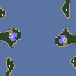](https://ashleynewson.github.io/openra-map-generator/version-20240603/?settings=eyJzZWVkIjotMTE4OTI5MjcyNywic2l6ZSI6OTYsInJvdGF0aW9ucyI6MiwibWlycm9yIjowLCJwbGF5ZXJzIjoxLCJjdXN0b21OYW1lIjoiIiwid2F2ZWxlbmd0aFNjYWxlIjowLjIsIndhdGVyIjowLjgsIm1vdW50YWlucyI6MC4xLCJmb3Jlc3RzIjowLCJleHRlcm5hbENpcmN1bGFyQmlhcyI6MCwidGVycmFpblNtb290aGluZyI6NCwic21vb3RoaW5nVGhyZXNob2xkIjowLjMzLCJtaW5pbXVtTGFuZFNlYVRoaWNrbmVzcyI6NSwibWluaW11bU1vdW50YWluVGhpY2tuZXNzIjo1LCJtYXhpbXVtQWx0aXR1ZGUiOjgsInJvdWdobmVzc1JhZGl1cyI6NSwicm91Z2huZXNzIjowLjUsIm1pbmltdW1UZXJyYWluQ29udG91clNwYWNpbmciOjYsIm1pbmltdW1DbGlmZkxlbmd0aCI6MTAsImZvcmVzdENsdW1waW5lc3MiOjAuNSwiZGVueVdhbGxlZEFyZWFzIjp0cnVlLCJlbmZvcmNlU3ltbWV0cnkiOmZhbHNlLCJjcmVhdGVFbnRpdGllcyI6dHJ1ZSwic3RhcnRpbmdNaW5lcyI6Mywic3RhcnRpbmdPcmUiOjMsImNlbnRyYWxSZXNlcnZhdGlvbiI6MTYsInNwYXduUmVnaW9uU2l6ZSI6MTYsInNwYXduQnVpbGRTaXplIjo4LCJzcGF3bk1pbmVzIjozLCJzcGF3bk9yZSI6MywibWF4aW11bUV4cGFuc2lvbnMiOjQsIm1pbmltdW1FeHBhbnNpb25TaXplIjoyLCJtYXhpbXVtRXhwYW5zaW9uU2l6ZSI6MTIsImV4cGFuc2lvbklubmVyIjo0LCJleHBhbnNpb25Cb3JkZXIiOjQsImV4cGFuc2lvbk1pbmVzIjowLjAyLCJleHBhbnNpb25PcmUiOjUsImdlbVVwZ3JhZGUiOjAuMSwibWluaW11bUJ1aWxkaW5ncyI6MCwibWF4aW11bUJ1aWxkaW5ncyI6Mywid2VpZ2h0RmNvbSI6MSwid2VpZ2h0SG9zcCI6Miwid2VpZ2h0TWlzcyI6Miwid2VpZ2h0QmlvIjowLCJ3ZWlnaHRPaWxiIjo4fQ==) [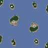](https://ashleynewson.github.io/openra-map-generator/version-20240603/?settings=eyJzZWVkIjotMjA4MjY0MTczLCJzaXplIjo5Niwicm90YXRpb25zIjoyLCJtaXJyb3IiOjAsInBsYXllcnMiOjEsImN1c3RvbU5hbWUiOiIiLCJ3YXZlbGVuZ3RoU2NhbGUiOjAuMiwid2F0ZXIiOjAuOCwibW91bnRhaW5zIjowLjEsImZvcmVzdHMiOjAsImV4dGVybmFsQ2lyY3VsYXJCaWFzIjowLCJ0ZXJyYWluU21vb3RoaW5nIjo0LCJzbW9vdGhpbmdUaHJlc2hvbGQiOjAuMzMsIm1pbmltdW1MYW5kU2VhVGhpY2tuZXNzIjo1LCJtaW5pbXVtTW91bnRhaW5UaGlja25lc3MiOjUsIm1heGltdW1BbHRpdHVkZSI6OCwicm91Z2huZXNzUmFkaXVzIjo1LCJyb3VnaG5lc3MiOjAuNSwibWluaW11bVRlcnJhaW5Db250b3VyU3BhY2luZyI6NiwibWluaW11bUNsaWZmTGVuZ3RoIjoxMCwiZm9yZXN0Q2x1bXBpbmVzcyI6MC41LCJkZW55V2FsbGVkQXJlYXMiOnRydWUsImVuZm9yY2VTeW1tZXRyeSI6ZmFsc2UsImNyZWF0ZUVudGl0aWVzIjp0cnVlLCJzdGFydGluZ01pbmVzIjozLCJzdGFydGluZ09yZSI6MywiY2VudHJhbFJlc2VydmF0aW9uIjoxNiwic3Bhd25SZWdpb25TaXplIjoxNiwic3Bhd25CdWlsZFNpemUiOjgsInNwYXduTWluZXMiOjMsInNwYXduT3JlIjozLCJtYXhpbXVtRXhwYW5zaW9ucyI6NCwibWluaW11bUV4cGFuc2lvblNpemUiOjIsIm1heGltdW1FeHBhbnNpb25TaXplIjoxMiwiZXhwYW5zaW9uSW5uZXIiOjQsImV4cGFuc2lvbkJvcmRlciI6NCwiZXhwYW5zaW9uTWluZXMiOjAuMDIsImV4cGFuc2lvbk9yZSI6NSwiZ2VtVXBncmFkZSI6MC4xLCJtaW5pbXVtQnVpbGRpbmdzIjowLCJtYXhpbXVtQnVpbGRpbmdzIjozLCJ3ZWlnaHRGY29tIjoxLCJ3ZWlnaHRIb3NwIjoyLCJ3ZWlnaHRNaXNzIjoyLCJ3ZWlnaHRCaW8iOjAsIndlaWdodE9pbGIiOjh9)

[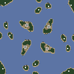](https://ashleynewson.github.io/openra-map-generator/version-20240603/?settings=eyJzZWVkIjotMzA2ODAzNzEyLCJzaXplIjoxMjgsInJvdGF0aW9ucyI6NCwibWlycm9yIjowLCJwbGF5ZXJzIjoxLCJjdXN0b21OYW1lIjoiIiwid2F2ZWxlbmd0aFNjYWxlIjowLjIsIndhdGVyIjowLjgsIm1vdW50YWlucyI6MC4xLCJmb3Jlc3RzIjowLCJleHRlcm5hbENpcmN1bGFyQmlhcyI6MCwidGVycmFpblNtb290aGluZyI6NCwic21vb3RoaW5nVGhyZXNob2xkIjowLjMzLCJtaW5pbXVtTGFuZFNlYVRoaWNrbmVzcyI6NSwibWluaW11bU1vdW50YWluVGhpY2tuZXNzIjo1LCJtYXhpbXVtQWx0aXR1ZGUiOjgsInJvdWdobmVzc1JhZGl1cyI6NSwicm91Z2huZXNzIjowLjUsIm1pbmltdW1UZXJyYWluQ29udG91clNwYWNpbmciOjYsIm1pbmltdW1DbGlmZkxlbmd0aCI6MTAsImZvcmVzdENsdW1waW5lc3MiOjAuNSwiZGVueVdhbGxlZEFyZWFzIjp0cnVlLCJlbmZvcmNlU3ltbWV0cnkiOmZhbHNlLCJjcmVhdGVFbnRpdGllcyI6dHJ1ZSwic3RhcnRpbmdNaW5lcyI6Mywic3RhcnRpbmdPcmUiOjMsImNlbnRyYWxSZXNlcnZhdGlvbiI6MTYsInNwYXduUmVnaW9uU2l6ZSI6MTYsInNwYXduQnVpbGRTaXplIjo4LCJzcGF3bk1pbmVzIjozLCJzcGF3bk9yZSI6MywibWF4aW11bUV4cGFuc2lvbnMiOjQsIm1pbmltdW1FeHBhbnNpb25TaXplIjoyLCJtYXhpbXVtRXhwYW5zaW9uU2l6ZSI6MTIsImV4cGFuc2lvbklubmVyIjo0LCJleHBhbnNpb25Cb3JkZXIiOjQsImV4cGFuc2lvbk1pbmVzIjowLjAyLCJleHBhbnNpb25PcmUiOjUsImdlbVVwZ3JhZGUiOjAuMSwibWluaW11bUJ1aWxkaW5ncyI6MCwibWF4aW11bUJ1aWxkaW5ncyI6Mywid2VpZ2h0RmNvbSI6MSwid2VpZ2h0SG9zcCI6Miwid2VpZ2h0TWlzcyI6Miwid2VpZ2h0QmlvIjowLCJ3ZWlnaHRPaWxiIjo4fQ==) [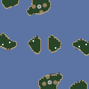](https://ashleynewson.github.io/openra-map-generator/version-20240603/?settings=eyJzZWVkIjoxNTUzNTYyMjczLCJzaXplIjoxMjgsInJvdGF0aW9ucyI6MiwibWlycm9yIjowLCJwbGF5ZXJzIjoxLCJjdXN0b21OYW1lIjoiIiwid2F2ZWxlbmd0aFNjYWxlIjowLjIsIndhdGVyIjowLjgsIm1vdW50YWlucyI6MC4xLCJmb3Jlc3RzIjowLCJleHRlcm5hbENpcmN1bGFyQmlhcyI6MCwidGVycmFpblNtb290aGluZyI6NCwic21vb3RoaW5nVGhyZXNob2xkIjowLjMzLCJtaW5pbXVtTGFuZFNlYVRoaWNrbmVzcyI6NSwibWluaW11bU1vdW50YWluVGhpY2tuZXNzIjo1LCJtYXhpbXVtQWx0aXR1ZGUiOjgsInJvdWdobmVzc1JhZGl1cyI6NSwicm91Z2huZXNzIjowLjUsIm1pbmltdW1UZXJyYWluQ29udG91clNwYWNpbmciOjYsIm1pbmltdW1DbGlmZkxlbmd0aCI6MTAsImZvcmVzdENsdW1waW5lc3MiOjAuNSwiZGVueVdhbGxlZEFyZWFzIjp0cnVlLCJlbmZvcmNlU3ltbWV0cnkiOmZhbHNlLCJjcmVhdGVFbnRpdGllcyI6dHJ1ZSwic3RhcnRpbmdNaW5lcyI6Mywic3RhcnRpbmdPcmUiOjMsImNlbnRyYWxSZXNlcnZhdGlvbiI6MTYsInNwYXduUmVnaW9uU2l6ZSI6MTYsInNwYXduQnVpbGRTaXplIjo4LCJzcGF3bk1pbmVzIjozLCJzcGF3bk9yZSI6MywibWF4aW11bUV4cGFuc2lvbnMiOjQsIm1pbmltdW1FeHBhbnNpb25TaXplIjoyLCJtYXhpbXVtRXhwYW5zaW9uU2l6ZSI6MTIsImV4cGFuc2lvbklubmVyIjo0LCJleHBhbnNpb25Cb3JkZXIiOjQsImV4cGFuc2lvbk1pbmVzIjowLjAyLCJleHBhbnNpb25PcmUiOjUsImdlbVVwZ3JhZGUiOjAuMSwibWluaW11bUJ1aWxkaW5ncyI6MCwibWF4aW11bUJ1aWxkaW5ncyI6Mywid2VpZ2h0RmNvbSI6MSwid2VpZ2h0SG9zcCI6Miwid2VpZ2h0TWlzcyI6Miwid2VpZ2h0QmlvIjowLCJ3ZWlnaHRPaWxiIjo4fQ==)

### Large Islands

Fewer but more spacious islands.

[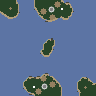](https://ashleynewson.github.io/openra-map-generator/version-20240603/?settings=eyJzZWVkIjotMTMxMTk4MTA4Niwic2l6ZSI6OTYsInJvdGF0aW9ucyI6MiwibWlycm9yIjowLCJwbGF5ZXJzIjoxLCJjdXN0b21OYW1lIjoiIiwid2F2ZWxlbmd0aFNjYWxlIjowLjUsIndhdGVyIjowLjc1LCJtb3VudGFpbnMiOjAuMSwiZm9yZXN0cyI6MCwiZXh0ZXJuYWxDaXJjdWxhckJpYXMiOjAsInRlcnJhaW5TbW9vdGhpbmciOjQsInNtb290aGluZ1RocmVzaG9sZCI6MC4zMywibWluaW11bUxhbmRTZWFUaGlja25lc3MiOjUsIm1pbmltdW1Nb3VudGFpblRoaWNrbmVzcyI6NSwibWF4aW11bUFsdGl0dWRlIjo4LCJyb3VnaG5lc3NSYWRpdXMiOjUsInJvdWdobmVzcyI6MC41LCJtaW5pbXVtVGVycmFpbkNvbnRvdXJTcGFjaW5nIjo2LCJtaW5pbXVtQ2xpZmZMZW5ndGgiOjEwLCJmb3Jlc3RDbHVtcGluZXNzIjowLjUsImRlbnlXYWxsZWRBcmVhcyI6dHJ1ZSwiZW5mb3JjZVN5bW1ldHJ5IjpmYWxzZSwiY3JlYXRlRW50aXRpZXMiOnRydWUsInN0YXJ0aW5nTWluZXMiOjMsInN0YXJ0aW5nT3JlIjozLCJjZW50cmFsUmVzZXJ2YXRpb24iOjE2LCJzcGF3blJlZ2lvblNpemUiOjE2LCJzcGF3bkJ1aWxkU2l6ZSI6OCwic3Bhd25NaW5lcyI6Mywic3Bhd25PcmUiOjMsIm1heGltdW1FeHBhbnNpb25zIjo0LCJtaW5pbXVtRXhwYW5zaW9uU2l6ZSI6MiwibWF4aW11bUV4cGFuc2lvblNpemUiOjEyLCJleHBhbnNpb25Jbm5lciI6NCwiZXhwYW5zaW9uQm9yZGVyIjo0LCJleHBhbnNpb25NaW5lcyI6MC4wMiwiZXhwYW5zaW9uT3JlIjo1LCJnZW1VcGdyYWRlIjowLjEsIm1pbmltdW1CdWlsZGluZ3MiOjAsIm1heGltdW1CdWlsZGluZ3MiOjMsIndlaWdodEZjb20iOjEsIndlaWdodEhvc3AiOjIsIndlaWdodE1pc3MiOjIsIndlaWdodEJpbyI6MCwid2VpZ2h0T2lsYiI6OH0=) [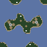](https://ashleynewson.github.io/openra-map-generator/version-20240603/?settings=eyJzZWVkIjoxNDIxNDkzMDYsInNpemUiOjk2LCJyb3RhdGlvbnMiOjIsIm1pcnJvciI6MCwicGxheWVycyI6MSwiY3VzdG9tTmFtZSI6IiIsIndhdmVsZW5ndGhTY2FsZSI6MC41LCJ3YXRlciI6MC43NSwibW91bnRhaW5zIjowLjEsImZvcmVzdHMiOjAsImV4dGVybmFsQ2lyY3VsYXJCaWFzIjowLCJ0ZXJyYWluU21vb3RoaW5nIjo0LCJzbW9vdGhpbmdUaHJlc2hvbGQiOjAuMzMsIm1pbmltdW1MYW5kU2VhVGhpY2tuZXNzIjo1LCJtaW5pbXVtTW91bnRhaW5UaGlja25lc3MiOjUsIm1heGltdW1BbHRpdHVkZSI6OCwicm91Z2huZXNzUmFkaXVzIjo1LCJyb3VnaG5lc3MiOjAuNSwibWluaW11bVRlcnJhaW5Db250b3VyU3BhY2luZyI6NiwibWluaW11bUNsaWZmTGVuZ3RoIjoxMCwiZm9yZXN0Q2x1bXBpbmVzcyI6MC41LCJkZW55V2FsbGVkQXJlYXMiOnRydWUsImVuZm9yY2VTeW1tZXRyeSI6ZmFsc2UsImNyZWF0ZUVudGl0aWVzIjp0cnVlLCJzdGFydGluZ01pbmVzIjozLCJzdGFydGluZ09yZSI6MywiY2VudHJhbFJlc2VydmF0aW9uIjoxNiwic3Bhd25SZWdpb25TaXplIjoxNiwic3Bhd25CdWlsZFNpemUiOjgsInNwYXduTWluZXMiOjMsInNwYXduT3JlIjozLCJtYXhpbXVtRXhwYW5zaW9ucyI6NCwibWluaW11bUV4cGFuc2lvblNpemUiOjIsIm1heGltdW1FeHBhbnNpb25TaXplIjoxMiwiZXhwYW5zaW9uSW5uZXIiOjQsImV4cGFuc2lvbkJvcmRlciI6NCwiZXhwYW5zaW9uTWluZXMiOjAuMDIsImV4cGFuc2lvbk9yZSI6NSwiZ2VtVXBncmFkZSI6MC4xLCJtaW5pbXVtQnVpbGRpbmdzIjowLCJtYXhpbXVtQnVpbGRpbmdzIjozLCJ3ZWlnaHRGY29tIjoxLCJ3ZWlnaHRIb3NwIjoyLCJ3ZWlnaHRNaXNzIjoyLCJ3ZWlnaHRCaW8iOjAsIndlaWdodE9pbGIiOjh9) [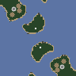](https://ashleynewson.github.io/openra-map-generator/version-20240603/?settings=eyJzZWVkIjotMTE5ODM4NjY1Mywic2l6ZSI6OTYsInJvdGF0aW9ucyI6MiwibWlycm9yIjowLCJwbGF5ZXJzIjoxLCJjdXN0b21OYW1lIjoiIiwid2F2ZWxlbmd0aFNjYWxlIjowLjUsIndhdGVyIjowLjc1LCJtb3VudGFpbnMiOjAuMSwiZm9yZXN0cyI6MCwiZXh0ZXJuYWxDaXJjdWxhckJpYXMiOjAsInRlcnJhaW5TbW9vdGhpbmciOjQsInNtb290aGluZ1RocmVzaG9sZCI6MC4zMywibWluaW11bUxhbmRTZWFUaGlja25lc3MiOjUsIm1pbmltdW1Nb3VudGFpblRoaWNrbmVzcyI6NSwibWF4aW11bUFsdGl0dWRlIjo4LCJyb3VnaG5lc3NSYWRpdXMiOjUsInJvdWdobmVzcyI6MC41LCJtaW5pbXVtVGVycmFpbkNvbnRvdXJTcGFjaW5nIjo2LCJtaW5pbXVtQ2xpZmZMZW5ndGgiOjEwLCJmb3Jlc3RDbHVtcGluZXNzIjowLjUsImRlbnlXYWxsZWRBcmVhcyI6dHJ1ZSwiZW5mb3JjZVN5bW1ldHJ5IjpmYWxzZSwiY3JlYXRlRW50aXRpZXMiOnRydWUsInN0YXJ0aW5nTWluZXMiOjMsInN0YXJ0aW5nT3JlIjozLCJjZW50cmFsUmVzZXJ2YXRpb24iOjE2LCJzcGF3blJlZ2lvblNpemUiOjE2LCJzcGF3bkJ1aWxkU2l6ZSI6OCwic3Bhd25NaW5lcyI6Mywic3Bhd25PcmUiOjMsIm1heGltdW1FeHBhbnNpb25zIjo0LCJtaW5pbXVtRXhwYW5zaW9uU2l6ZSI6MiwibWF4aW11bUV4cGFuc2lvblNpemUiOjEyLCJleHBhbnNpb25Jbm5lciI6NCwiZXhwYW5zaW9uQm9yZGVyIjo0LCJleHBhbnNpb25NaW5lcyI6MC4wMiwiZXhwYW5zaW9uT3JlIjo1LCJnZW1VcGdyYWRlIjowLjEsIm1pbmltdW1CdWlsZGluZ3MiOjAsIm1heGltdW1CdWlsZGluZ3MiOjMsIndlaWdodEZjb20iOjEsIndlaWdodEhvc3AiOjIsIndlaWdodE1pc3MiOjIsIndlaWdodEJpbyI6MCwid2VpZ2h0T2lsYiI6OH0=)

[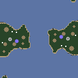](https://ashleynewson.github.io/openra-map-generator/version-20240603/?settings=eyJzZWVkIjotMTI0MTYyNDAzNiwic2l6ZSI6MTI4LCJyb3RhdGlvbnMiOjIsIm1pcnJvciI6MCwicGxheWVycyI6MSwiY3VzdG9tTmFtZSI6IiIsIndhdmVsZW5ndGhTY2FsZSI6MC41LCJ3YXRlciI6MC43NSwibW91bnRhaW5zIjowLjEsImZvcmVzdHMiOjAsImV4dGVybmFsQ2lyY3VsYXJCaWFzIjowLCJ0ZXJyYWluU21vb3RoaW5nIjo0LCJzbW9vdGhpbmdUaHJlc2hvbGQiOjAuMzMsIm1pbmltdW1MYW5kU2VhVGhpY2tuZXNzIjo1LCJtaW5pbXVtTW91bnRhaW5UaGlja25lc3MiOjUsIm1heGltdW1BbHRpdHVkZSI6OCwicm91Z2huZXNzUmFkaXVzIjo1LCJyb3VnaG5lc3MiOjAuNSwibWluaW11bVRlcnJhaW5Db250b3VyU3BhY2luZyI6NiwibWluaW11bUNsaWZmTGVuZ3RoIjoxMCwiZm9yZXN0Q2x1bXBpbmVzcyI6MC41LCJkZW55V2FsbGVkQXJlYXMiOnRydWUsImVuZm9yY2VTeW1tZXRyeSI6ZmFsc2UsImNyZWF0ZUVudGl0aWVzIjp0cnVlLCJzdGFydGluZ01pbmVzIjozLCJzdGFydGluZ09yZSI6MywiY2VudHJhbFJlc2VydmF0aW9uIjoxNiwic3Bhd25SZWdpb25TaXplIjoxNiwic3Bhd25CdWlsZFNpemUiOjgsInNwYXduTWluZXMiOjMsInNwYXduT3JlIjozLCJtYXhpbXVtRXhwYW5zaW9ucyI6NCwibWluaW11bUV4cGFuc2lvblNpemUiOjIsIm1heGltdW1FeHBhbnNpb25TaXplIjoxMiwiZXhwYW5zaW9uSW5uZXIiOjQsImV4cGFuc2lvbkJvcmRlciI6NCwiZXhwYW5zaW9uTWluZXMiOjAuMDIsImV4cGFuc2lvbk9yZSI6NSwiZ2VtVXBncmFkZSI6MC4xLCJtaW5pbXVtQnVpbGRpbmdzIjowLCJtYXhpbXVtQnVpbGRpbmdzIjozLCJ3ZWlnaHRGY29tIjoxLCJ3ZWlnaHRIb3NwIjoyLCJ3ZWlnaHRNaXNzIjoyLCJ3ZWlnaHRCaW8iOjAsIndlaWdodE9pbGIiOjh9) [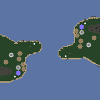](https://ashleynewson.github.io/openra-map-generator/version-20240603/?settings=eyJzZWVkIjo3MjE3NDI3NjMsInNpemUiOjEyOCwicm90YXRpb25zIjoyLCJtaXJyb3IiOjAsInBsYXllcnMiOjIsImN1c3RvbU5hbWUiOiIiLCJ3YXZlbGVuZ3RoU2NhbGUiOjAuNSwid2F0ZXIiOjAuNzUsIm1vdW50YWlucyI6MC4xLCJmb3Jlc3RzIjowLCJleHRlcm5hbENpcmN1bGFyQmlhcyI6MCwidGVycmFpblNtb290aGluZyI6NCwic21vb3RoaW5nVGhyZXNob2xkIjowLjMzLCJtaW5pbXVtTGFuZFNlYVRoaWNrbmVzcyI6NSwibWluaW11bU1vdW50YWluVGhpY2tuZXNzIjo1LCJtYXhpbXVtQWx0aXR1ZGUiOjgsInJvdWdobmVzc1JhZGl1cyI6NSwicm91Z2huZXNzIjowLjUsIm1pbmltdW1UZXJyYWluQ29udG91clNwYWNpbmciOjYsIm1pbmltdW1DbGlmZkxlbmd0aCI6MTAsImZvcmVzdENsdW1waW5lc3MiOjAuNSwiZGVueVdhbGxlZEFyZWFzIjp0cnVlLCJlbmZvcmNlU3ltbWV0cnkiOmZhbHNlLCJjcmVhdGVFbnRpdGllcyI6dHJ1ZSwic3RhcnRpbmdNaW5lcyI6Mywic3RhcnRpbmdPcmUiOjMsImNlbnRyYWxSZXNlcnZhdGlvbiI6MTYsInNwYXduUmVnaW9uU2l6ZSI6MTYsInNwYXduQnVpbGRTaXplIjo4LCJzcGF3bk1pbmVzIjozLCJzcGF3bk9yZSI6MywibWF4aW11bUV4cGFuc2lvbnMiOjQsIm1pbmltdW1FeHBhbnNpb25TaXplIjoyLCJtYXhpbXVtRXhwYW5zaW9uU2l6ZSI6MTIsImV4cGFuc2lvbklubmVyIjo0LCJleHBhbnNpb25Cb3JkZXIiOjQsImV4cGFuc2lvbk1pbmVzIjowLjAyLCJleHBhbnNpb25PcmUiOjUsImdlbVVwZ3JhZGUiOjAuMSwibWluaW11bUJ1aWxkaW5ncyI6MCwibWF4aW11bUJ1aWxkaW5ncyI6Mywid2VpZ2h0RmNvbSI6MSwid2VpZ2h0SG9zcCI6Miwid2VpZ2h0TWlzcyI6Miwid2VpZ2h0QmlvIjowLCJ3ZWlnaHRPaWxiIjo4fQ==)

### Lake District

Play on England's home turf! Come tour our mountainous lake district!

[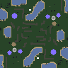](https://ashleynewson.github.io/openra-map-generator/version-20240603/?settings=eyJzZWVkIjo3ODQ3MzgzMiwic2l6ZSI6OTYsInJvdGF0aW9ucyI6MiwibWlycm9yIjowLCJwbGF5ZXJzIjoxLCJjdXN0b21OYW1lIjoiIiwid2F2ZWxlbmd0aFNjYWxlIjowLjIsIndhdGVyIjowLjIsIm1vdW50YWlucyI6MSwiZm9yZXN0cyI6MC4wMjUsImV4dGVybmFsQ2lyY3VsYXJCaWFzIjowLCJ0ZXJyYWluU21vb3RoaW5nIjo0LCJzbW9vdGhpbmdUaHJlc2hvbGQiOjAuMzMsIm1pbmltdW1MYW5kU2VhVGhpY2tuZXNzIjo1LCJtaW5pbXVtTW91bnRhaW5UaGlja25lc3MiOjUsIm1heGltdW1BbHRpdHVkZSI6OCwicm91Z2huZXNzUmFkaXVzIjo1LCJyb3VnaG5lc3MiOjAuNSwibWluaW11bVRlcnJhaW5Db250b3VyU3BhY2luZyI6NiwibWluaW11bUNsaWZmTGVuZ3RoIjoxMCwiZm9yZXN0Q2x1bXBpbmVzcyI6MC41LCJkZW55V2FsbGVkQXJlYXMiOnRydWUsImVuZm9yY2VTeW1tZXRyeSI6ZmFsc2UsImNyZWF0ZUVudGl0aWVzIjp0cnVlLCJzdGFydGluZ01pbmVzIjozLCJzdGFydGluZ09yZSI6MywiY2VudHJhbFJlc2VydmF0aW9uIjoxNiwic3Bhd25SZWdpb25TaXplIjoxNiwic3Bhd25CdWlsZFNpemUiOjgsInNwYXduTWluZXMiOjMsInNwYXduT3JlIjozLCJtYXhpbXVtRXhwYW5zaW9ucyI6NCwibWluaW11bUV4cGFuc2lvblNpemUiOjIsIm1heGltdW1FeHBhbnNpb25TaXplIjoxMiwiZXhwYW5zaW9uSW5uZXIiOjQsImV4cGFuc2lvbkJvcmRlciI6NCwiZXhwYW5zaW9uTWluZXMiOjAuMDIsImV4cGFuc2lvbk9yZSI6NSwiZ2VtVXBncmFkZSI6MC4xLCJtaW5pbXVtQnVpbGRpbmdzIjowLCJtYXhpbXVtQnVpbGRpbmdzIjozLCJ3ZWlnaHRGY29tIjoxLCJ3ZWlnaHRIb3NwIjoyLCJ3ZWlnaHRNaXNzIjoyLCJ3ZWlnaHRCaW8iOjAsIndlaWdodE9pbGIiOjh9) [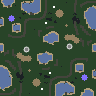](https://ashleynewson.github.io/openra-map-generator/version-20240603/?settings=eyJzZWVkIjotNDE1MzA2NTM3LCJzaXplIjo5Niwicm90YXRpb25zIjoyLCJtaXJyb3IiOjAsInBsYXllcnMiOjEsImN1c3RvbU5hbWUiOiIiLCJ3YXZlbGVuZ3RoU2NhbGUiOjAuMiwid2F0ZXIiOjAuMiwibW91bnRhaW5zIjoxLCJmb3Jlc3RzIjowLjAyNSwiZXh0ZXJuYWxDaXJjdWxhckJpYXMiOjAsInRlcnJhaW5TbW9vdGhpbmciOjQsInNtb290aGluZ1RocmVzaG9sZCI6MC4zMywibWluaW11bUxhbmRTZWFUaGlja25lc3MiOjUsIm1pbmltdW1Nb3VudGFpblRoaWNrbmVzcyI6NSwibWF4aW11bUFsdGl0dWRlIjo4LCJyb3VnaG5lc3NSYWRpdXMiOjUsInJvdWdobmVzcyI6MC41LCJtaW5pbXVtVGVycmFpbkNvbnRvdXJTcGFjaW5nIjo2LCJtaW5pbXVtQ2xpZmZMZW5ndGgiOjEwLCJmb3Jlc3RDbHVtcGluZXNzIjowLjUsImRlbnlXYWxsZWRBcmVhcyI6dHJ1ZSwiZW5mb3JjZVN5bW1ldHJ5IjpmYWxzZSwiY3JlYXRlRW50aXRpZXMiOnRydWUsInN0YXJ0aW5nTWluZXMiOjMsInN0YXJ0aW5nT3JlIjozLCJjZW50cmFsUmVzZXJ2YXRpb24iOjE2LCJzcGF3blJlZ2lvblNpemUiOjE2LCJzcGF3bkJ1aWxkU2l6ZSI6OCwic3Bhd25NaW5lcyI6Mywic3Bhd25PcmUiOjMsIm1heGltdW1FeHBhbnNpb25zIjo0LCJtaW5pbXVtRXhwYW5zaW9uU2l6ZSI6MiwibWF4aW11bUV4cGFuc2lvblNpemUiOjEyLCJleHBhbnNpb25Jbm5lciI6NCwiZXhwYW5zaW9uQm9yZGVyIjo0LCJleHBhbnNpb25NaW5lcyI6MC4wMiwiZXhwYW5zaW9uT3JlIjo1LCJnZW1VcGdyYWRlIjowLjEsIm1pbmltdW1CdWlsZGluZ3MiOjAsIm1heGltdW1CdWlsZGluZ3MiOjMsIndlaWdodEZjb20iOjEsIndlaWdodEhvc3AiOjIsIndlaWdodE1pc3MiOjIsIndlaWdodEJpbyI6MCwid2VpZ2h0T2lsYiI6OH0=) [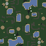](https://ashleynewson.github.io/openra-map-generator/version-20240603/?settings=eyJzZWVkIjo1Mjg3NDQ3NSwic2l6ZSI6OTYsInJvdGF0aW9ucyI6MiwibWlycm9yIjowLCJwbGF5ZXJzIjoxLCJjdXN0b21OYW1lIjoiIiwid2F2ZWxlbmd0aFNjYWxlIjowLjIsIndhdGVyIjowLjIsIm1vdW50YWlucyI6MSwiZm9yZXN0cyI6MC4wMjUsImV4dGVybmFsQ2lyY3VsYXJCaWFzIjowLCJ0ZXJyYWluU21vb3RoaW5nIjo0LCJzbW9vdGhpbmdUaHJlc2hvbGQiOjAuMzMsIm1pbmltdW1MYW5kU2VhVGhpY2tuZXNzIjo1LCJtaW5pbXVtTW91bnRhaW5UaGlja25lc3MiOjUsIm1heGltdW1BbHRpdHVkZSI6OCwicm91Z2huZXNzUmFkaXVzIjo1LCJyb3VnaG5lc3MiOjAuNSwibWluaW11bVRlcnJhaW5Db250b3VyU3BhY2luZyI6NiwibWluaW11bUNsaWZmTGVuZ3RoIjoxMCwiZm9yZXN0Q2x1bXBpbmVzcyI6MC41LCJkZW55V2FsbGVkQXJlYXMiOnRydWUsImVuZm9yY2VTeW1tZXRyeSI6ZmFsc2UsImNyZWF0ZUVudGl0aWVzIjp0cnVlLCJzdGFydGluZ01pbmVzIjozLCJzdGFydGluZ09yZSI6MywiY2VudHJhbFJlc2VydmF0aW9uIjoxNiwic3Bhd25SZWdpb25TaXplIjoxNiwic3Bhd25CdWlsZFNpemUiOjgsInNwYXduTWluZXMiOjMsInNwYXduT3JlIjozLCJtYXhpbXVtRXhwYW5zaW9ucyI6NCwibWluaW11bUV4cGFuc2lvblNpemUiOjIsIm1heGltdW1FeHBhbnNpb25TaXplIjoxMiwiZXhwYW5zaW9uSW5uZXIiOjQsImV4cGFuc2lvbkJvcmRlciI6NCwiZXhwYW5zaW9uTWluZXMiOjAuMDIsImV4cGFuc2lvbk9yZSI6NSwiZ2VtVXBncmFkZSI6MC4xLCJtaW5pbXVtQnVpbGRpbmdzIjowLCJtYXhpbXVtQnVpbGRpbmdzIjozLCJ3ZWlnaHRGY29tIjoxLCJ3ZWlnaHRIb3NwIjoyLCJ3ZWlnaHRNaXNzIjoyLCJ3ZWlnaHRCaW8iOjAsIndlaWdodE9pbGIiOjh9)

[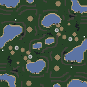](https://ashleynewson.github.io/openra-map-generator/version-20240603/?settings=eyJzZWVkIjoyMDQ3MDA2OTU0LCJzaXplIjoxMjgsInJvdGF0aW9ucyI6MiwibWlycm9yIjowLCJwbGF5ZXJzIjoyLCJjdXN0b21OYW1lIjoiIiwid2F2ZWxlbmd0aFNjYWxlIjowLjIsIndhdGVyIjowLjIsIm1vdW50YWlucyI6MSwiZm9yZXN0cyI6MC4wMjUsImV4dGVybmFsQ2lyY3VsYXJCaWFzIjowLCJ0ZXJyYWluU21vb3RoaW5nIjo0LCJzbW9vdGhpbmdUaHJlc2hvbGQiOjAuMzMsIm1pbmltdW1MYW5kU2VhVGhpY2tuZXNzIjo1LCJtaW5pbXVtTW91bnRhaW5UaGlja25lc3MiOjUsIm1heGltdW1BbHRpdHVkZSI6OCwicm91Z2huZXNzUmFkaXVzIjo1LCJyb3VnaG5lc3MiOjAuNSwibWluaW11bVRlcnJhaW5Db250b3VyU3BhY2luZyI6NiwibWluaW11bUNsaWZmTGVuZ3RoIjoxMCwiZm9yZXN0Q2x1bXBpbmVzcyI6MC41LCJkZW55V2FsbGVkQXJlYXMiOnRydWUsImVuZm9yY2VTeW1tZXRyeSI6ZmFsc2UsImNyZWF0ZUVudGl0aWVzIjp0cnVlLCJzdGFydGluZ01pbmVzIjozLCJzdGFydGluZ09yZSI6MywiY2VudHJhbFJlc2VydmF0aW9uIjoxNiwic3Bhd25SZWdpb25TaXplIjoxNiwic3Bhd25CdWlsZFNpemUiOjgsInNwYXduTWluZXMiOjMsInNwYXduT3JlIjozLCJtYXhpbXVtRXhwYW5zaW9ucyI6NCwibWluaW11bUV4cGFuc2lvblNpemUiOjIsIm1heGltdW1FeHBhbnNpb25TaXplIjoxMiwiZXhwYW5zaW9uSW5uZXIiOjQsImV4cGFuc2lvbkJvcmRlciI6NCwiZXhwYW5zaW9uTWluZXMiOjAuMDIsImV4cGFuc2lvbk9yZSI6NSwiZ2VtVXBncmFkZSI6MC4xLCJtaW5pbXVtQnVpbGRpbmdzIjowLCJtYXhpbXVtQnVpbGRpbmdzIjozLCJ3ZWlnaHRGY29tIjoxLCJ3ZWlnaHRIb3NwIjoyLCJ3ZWlnaHRNaXNzIjoyLCJ3ZWlnaHRCaW8iOjAsIndlaWdodE9pbGIiOjh9) [](https://ashleynewson.github.io/openra-map-generator/version-20240603/?settings=eyJzZWVkIjotMTgwODkzNTksInNpemUiOjEyOCwicm90YXRpb25zIjoxLCJtaXJyb3IiOjQsInBsYXllcnMiOjIsImN1c3RvbU5hbWUiOiIiLCJ3YXZlbGVuZ3RoU2NhbGUiOjAuMiwid2F0ZXIiOjAuMiwibW91bnRhaW5zIjoxLCJmb3Jlc3RzIjowLjAyNSwiZXh0ZXJuYWxDaXJjdWxhckJpYXMiOjAsInRlcnJhaW5TbW9vdGhpbmciOjQsInNtb290aGluZ1RocmVzaG9sZCI6MC4zMywibWluaW11bUxhbmRTZWFUaGlja25lc3MiOjUsIm1pbmltdW1Nb3VudGFpblRoaWNrbmVzcyI6NSwibWF4aW11bUFsdGl0dWRlIjo4LCJyb3VnaG5lc3NSYWRpdXMiOjUsInJvdWdobmVzcyI6MC41LCJtaW5pbXVtVGVycmFpbkNvbnRvdXJTcGFjaW5nIjo2LCJtaW5pbXVtQ2xpZmZMZW5ndGgiOjEwLCJmb3Jlc3RDbHVtcGluZXNzIjowLjUsImRlbnlXYWxsZWRBcmVhcyI6dHJ1ZSwiZW5mb3JjZVN5bW1ldHJ5IjpmYWxzZSwiY3JlYXRlRW50aXRpZXMiOnRydWUsInN0YXJ0aW5nTWluZXMiOjMsInN0YXJ0aW5nT3JlIjozLCJjZW50cmFsUmVzZXJ2YXRpb24iOjE2LCJzcGF3blJlZ2lvblNpemUiOjE2LCJzcGF3bkJ1aWxkU2l6ZSI6OCwic3Bhd25NaW5lcyI6Mywic3Bhd25PcmUiOjMsIm1heGltdW1FeHBhbnNpb25zIjo0LCJtaW5pbXVtRXhwYW5zaW9uU2l6ZSI6MiwibWF4aW11bUV4cGFuc2lvblNpemUiOjEyLCJleHBhbnNpb25Jbm5lciI6NCwiZXhwYW5zaW9uQm9yZGVyIjo0LCJleHBhbnNpb25NaW5lcyI6MC4wMiwiZXhwYW5zaW9uT3JlIjo1LCJnZW1VcGdyYWRlIjowLjEsIm1pbmltdW1CdWlsZGluZ3MiOjAsIm1heGltdW1CdWlsZGluZ3MiOjMsIndlaWdodEZjb20iOjEsIndlaWdodEhvc3AiOjIsIndlaWdodE1pc3MiOjIsIndlaWdodEJpbyI6MCwid2VpZ2h0T2lsYiI6OH0=)
